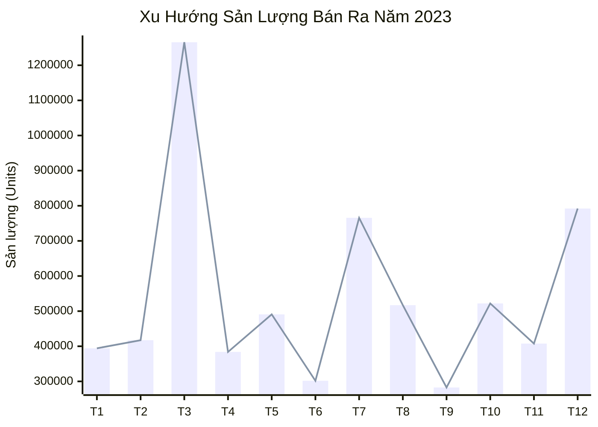

# Báo Cáo Xuất Nhập Tồn Hoàn Chỉnh Năm 2023

<table class="xnt-table">
  <thead>
    <tr>
      <th rowspan="2">MẶT HÀNG / VT</th>
      <th rowspan="2">ĐVT</th>
      <th colspan="2">TỒN ĐẦU KỲ</th>
      <th colspan="2">NHẬP TRONG KỲ</th>
      <th colspan="2">XUẤT TRONG KỲ</th>
      <th colspan="2">TỒN CUỐI KỲ</th>
    </tr>
    <tr>
      <th>SL</th>
      <th>TIỀN</th>
      <th>SL</th>
      <th>TIỀN</th>
      <th>SL</th>
      <th>TIỀN</th>
      <th>SL</th>
      <th>TIỀN</th>
    </tr>
  </thead>
  <tbody>
    <tr>
      <td class="text-left item-name">AACV4N____AL ANLENE CONCENTRATE VANILLA 4x125ML NEW</td>
      <td>Lốc</td>
      <td class="qty-col">1,221</td>
      <td class="text-right amt-col">28,318,515 đ</td>
      <td class="qty-col">0</td>
      <td class="text-right amt-col">0 đ</td>
      <td class="qty-col">1,089</td>
      <td class="text-right amt-col">29,714,181 đ</td>
      <td class="qty-col">132</td>
      <td class="text-right amt-col">3,061,461 đ</td>
    </tr>
    <tr>
      <td class="text-left item-name">AAGVM4G____AL Anlene Gold Vanilla Movepro 440g</td>
      <td>Hộp</td>
      <td class="qty-col">354</td>
      <td class="text-right amt-col">26,136,407 đ</td>
      <td class="qty-col">0</td>
      <td class="text-right amt-col">0 đ</td>
      <td class="qty-col">204</td>
      <td class="text-right amt-col">17,719,598 đ</td>
      <td class="qty-col">150</td>
      <td class="text-right amt-col">11,074,749 đ</td>
    </tr>
    <tr>
      <td class="text-left item-name">AAMU1-CĐ____AL Anlene Movepro UHT 180ml - Có đường</td>
      <td>Lốc</td>
      <td class="qty-col">894</td>
      <td class="text-right amt-col">13,128,613 đ</td>
      <td class="qty-col">0</td>
      <td class="text-right amt-col">0 đ</td>
      <td class="qty-col">778</td>
      <td class="text-right amt-col">13,441,322 đ</td>
      <td class="qty-col">116</td>
      <td class="text-right amt-col">1,703,489 đ</td>
    </tr>
    <tr>
      <td class="text-left item-name">AAMU1-KB____AL Anlene Movepro UHT 180ml - Không béo</td>
      <td>Lốc</td>
      <td class="qty-col">180</td>
      <td class="text-right amt-col">2,046,987 đ</td>
      <td class="qty-col">0</td>
      <td class="text-right amt-col">0 đ</td>
      <td class="qty-col">102</td>
      <td class="text-right amt-col">1,364,658 đ</td>
      <td class="qty-col">78</td>
      <td class="text-right amt-col">887,028 đ</td>
    </tr>
    <tr>
      <td class="text-left item-name">AAVM8____AL Anlene Vanilla Movepro 800g</td>
      <td>Lon</td>
      <td class="qty-col">192</td>
      <td class="text-right amt-col">27,821,212 đ</td>
      <td class="qty-col">0</td>
      <td class="text-right amt-col">0 đ</td>
      <td class="qty-col">144</td>
      <td class="text-right amt-col">24,548,128 đ</td>
      <td class="qty-col">48</td>
      <td class="text-right amt-col">6,955,303 đ</td>
    </tr>
    <tr>
      <td class="text-left item-name">ATAG3HV40G____AL Anlene Gold Vanilla Movepro 400g</td>
      <td>Lon</td>
      <td class="qty-col">510</td>
      <td class="text-right amt-col">40,787,733 đ</td>
      <td class="qty-col">0</td>
      <td class="text-right amt-col">0 đ</td>
      <td class="qty-col">283</td>
      <td class="text-right amt-col">26,627,286 đ</td>
      <td class="qty-col">227</td>
      <td class="text-right amt-col">18,154,540 đ</td>
    </tr>
    <tr>
      <td class="text-left item-name">B(PVBVD2(____BEL (KM) PM vuông Belcube vị Dâu 26g (km)</td>
      <td>Gói</td>
      <td class="qty-col">1,530</td>
      <td class="text-right amt-col">0 đ</td>
      <td class="qty-col">0</td>
      <td class="text-right amt-col">0 đ</td>
      <td class="qty-col">1,500</td>
      <td class="text-right amt-col">0 đ</td>
      <td class="qty-col">30</td>
      <td class="text-right amt-col">0 đ</td>
    </tr>
    <tr>
      <td class="text-left item-name">BPMBC1M____BEL Phô mai CBC 16M</td>
      <td>Hộp</td>
      <td class="qty-col">54,912</td>
      <td class="text-right amt-col">2,621,842,864 đ</td>
      <td class="qty-col">0</td>
      <td class="text-right amt-col">0 đ</td>
      <td class="qty-col">52,011</td>
      <td class="text-right amt-col">2,921,565,825 đ</td>
      <td class="qty-col">2,901</td>
      <td class="text-right amt-col">138,511,913 đ</td>
    </tr>
    <tr>
      <td class="text-left item-name">BPMBC8M____BEL Phô mai CBC 8M</td>
      <td>Hộp</td>
      <td class="qty-col">105,230</td>
      <td class="text-right amt-col">2,837,621,615 đ</td>
      <td class="qty-col">0</td>
      <td class="text-right amt-col">0 đ</td>
      <td class="qty-col">103,893</td>
      <td class="text-right amt-col">3,295,962,597 đ</td>
      <td class="qty-col">1,337</td>
      <td class="text-right amt-col">36,053,408 đ</td>
    </tr>
    <tr>
      <td class="text-left item-name">BPMC12T____BEL Phô mai CBC 16M 240g Tết</td>
      <td>Hộp</td>
      <td class="qty-col">3,107</td>
      <td class="text-right amt-col">153,175,100 đ</td>
      <td class="qty-col">0</td>
      <td class="text-right amt-col">0 đ</td>
      <td class="qty-col">1,991</td>
      <td class="text-right amt-col">115,478,000 đ</td>
      <td class="qty-col">1,116</td>
      <td class="text-right amt-col">55,018,800 đ</td>
    </tr>
    <tr>
      <td class="text-left item-name">BPMC2____BEL Phô mai CBC 24M</td>
      <td>Hộp</td>
      <td class="qty-col">1,776</td>
      <td class="text-right amt-col">123,787,200 đ</td>
      <td class="qty-col">0</td>
      <td class="text-right amt-col">0 đ</td>
      <td class="qty-col">1,776</td>
      <td class="text-right amt-col">145,632,000 đ</td>
      <td class="qty-col">0</td>
      <td class="text-right amt-col">0 đ</td>
    </tr>
    <tr>
      <td class="text-left item-name">BPMC2H____BEL pho mai CBC 24m HRC6</td>
      <td>Hộp</td>
      <td class="qty-col">0</td>
      <td class="text-right amt-col">0 đ</td>
      <td class="qty-col">0</td>
      <td class="text-right amt-col">0 đ</td>
      <td class="qty-col">0</td>
      <td class="text-right amt-col">0 đ</td>
      <td class="qty-col">0</td>
      <td class="text-right amt-col">0 đ</td>
    </tr>
    <tr>
      <td class="text-left item-name">BPMC81T____BEL Phô mai CBC 8M 120g Tết</td>
      <td>Hộp</td>
      <td class="qty-col">5,490</td>
      <td class="text-right amt-col">152,594,550 đ</td>
      <td class="qty-col">0</td>
      <td class="text-right amt-col">0 đ</td>
      <td class="qty-col">1,627</td>
      <td class="text-right amt-col">53,202,900 đ</td>
      <td class="qty-col">3,863</td>
      <td class="text-right amt-col">107,372,085 đ</td>
    </tr>
    <tr>
      <td class="text-left item-name">BPMCVS1____BEL PM vuông Belcube vị sữa 125g</td>
      <td>Gói</td>
      <td class="qty-col">306</td>
      <td class="text-right amt-col">0 đ</td>
      <td class="qty-col">0</td>
      <td class="text-right amt-col">0 đ</td>
      <td class="qty-col">0</td>
      <td class="text-right amt-col">0 đ</td>
      <td class="qty-col">306</td>
      <td class="text-right amt-col">0 đ</td>
    </tr>
    <tr>
      <td class="text-left item-name">BPMCVS7____BEL PM vuông Belcube vị sữa 78g</td>
      <td>Gói</td>
      <td class="qty-col">2,000</td>
      <td class="text-right amt-col">0 đ</td>
      <td class="qty-col">0</td>
      <td class="text-right amt-col">0 đ</td>
      <td class="qty-col">0</td>
      <td class="text-right amt-col">0 đ</td>
      <td class="qty-col">2,000</td>
      <td class="text-right amt-col">0 đ</td>
    </tr>
    <tr>
      <td class="text-left item-name">BPMLB2____BEL PM Lát CBC Burger 200gx32</td>
      <td>Gói</td>
      <td class="qty-col">551</td>
      <td class="text-right amt-col">21,087,876 đ</td>
      <td class="qty-col">0</td>
      <td class="text-right amt-col">0 đ</td>
      <td class="qty-col">421</td>
      <td class="text-right amt-col">18,955,900 đ</td>
      <td class="qty-col">130</td>
      <td class="text-right amt-col">4,975,361 đ</td>
    </tr>
    <tr>
      <td class="text-left item-name">C(DDTSP2(____CLM (KM) Dầu dấm trộn salad pet 270g (km)</td>
      <td>Chai</td>
      <td class="qty-col">922</td>
      <td class="text-right amt-col">0 đ</td>
      <td class="qty-col">0</td>
      <td class="text-right amt-col">0 đ</td>
      <td class="qty-col">922</td>
      <td class="text-right amt-col">0 đ</td>
      <td class="qty-col">0</td>
      <td class="text-right amt-col">0 đ</td>
    </tr>
    <tr>
      <td class="text-left item-name">C(DHP3(____CLM (KM) Dầu hào pet 350gr (km)</td>
      <td>Chai</td>
      <td class="qty-col">2,275</td>
      <td class="text-right amt-col">0 đ</td>
      <td class="qty-col">0</td>
      <td class="text-right amt-col">0 đ</td>
      <td class="qty-col">2,274</td>
      <td class="text-right amt-col">0 đ</td>
      <td class="qty-col">1</td>
      <td class="text-right amt-col">0 đ</td>
    </tr>
    <tr>
      <td class="text-left item-name">C(DHP8(____CLM (KM) Dầu hào pet 820g (km)</td>
      <td>Chai</td>
      <td class="qty-col">383</td>
      <td class="text-right amt-col">0 đ</td>
      <td class="qty-col">0</td>
      <td class="text-right amt-col">0 đ</td>
      <td class="qty-col">378</td>
      <td class="text-right amt-col">0 đ</td>
      <td class="qty-col">5</td>
      <td class="text-right amt-col">0 đ</td>
    </tr>
    <tr>
      <td class="text-left item-name">C(LCHST(____CLM (KM) Xốt lẩu chua hải sản TT 200g (km)</td>
      <td>Chai</td>
      <td class="qty-col">-18,696</td>
      <td class="text-right amt-col">-288,644,796 đ</td>
      <td class="qty-col">18,696</td>
      <td class="text-right amt-col">288,644,796 đ</td>
      <td class="qty-col">0</td>
      <td class="text-right amt-col">0 đ</td>
      <td class="qty-col">0</td>
      <td class="text-right amt-col">0 đ</td>
    </tr>
    <tr>
      <td class="text-left item-name">C(LT2(____CLM (KM) Lẩu thái 280g (km)</td>
      <td>Chai</td>
      <td class="qty-col">759</td>
      <td class="text-right amt-col">0 đ</td>
      <td class="qty-col">0</td>
      <td class="text-right amt-col">0 đ</td>
      <td class="qty-col">759</td>
      <td class="text-right amt-col">0 đ</td>
      <td class="qty-col">0</td>
      <td class="text-right amt-col">0 đ</td>
    </tr>
    <tr>
      <td class="text-left item-name">C(NMC4ĐĐ7(____CLM (KM) Nước mắm Cholimex 40 độ đạm 750ml (km)</td>
      <td>Chai</td>
      <td class="qty-col">-120</td>
      <td class="text-right amt-col">-8,488,920 đ</td>
      <td class="qty-col">120</td>
      <td class="text-right amt-col">8,488,920 đ</td>
      <td class="qty-col">0</td>
      <td class="text-right amt-col">0 đ</td>
      <td class="qty-col">0</td>
      <td class="text-right amt-col">0 đ</td>
    </tr>
    <tr>
      <td class="text-left item-name">C(NMHV5(____CLM (KM) Nước Mắm Hương Việt 500ml (km)</td>
      <td>Chai</td>
      <td class="qty-col">194</td>
      <td class="text-right amt-col">0 đ</td>
      <td class="qty-col">0</td>
      <td class="text-right amt-col">0 đ</td>
      <td class="qty-col">170</td>
      <td class="text-right amt-col">0 đ</td>
      <td class="qty-col">24</td>
      <td class="text-right amt-col">0 đ</td>
    </tr>
    <tr>
      <td class="text-left item-name">C(NMHV5HOC(____CLM (KM) Nước Mắm Hương Việt 500ml hàng onpack chén (km)</td>
      <td>Chai</td>
      <td class="qty-col">261</td>
      <td class="text-right amt-col">0 đ</td>
      <td class="qty-col">0</td>
      <td class="text-right amt-col">0 đ</td>
      <td class="qty-col">258</td>
      <td class="text-right amt-col">0 đ</td>
      <td class="qty-col">3</td>
      <td class="text-right amt-col">0 đ</td>
    </tr>
    <tr>
      <td class="text-left item-name">C(NTTV5(____CLM (KM) Nước tương thanh vị 500ml (km)</td>
      <td>Chai</td>
      <td class="qty-col">13,600</td>
      <td class="text-right amt-col">0 đ</td>
      <td class="qty-col">0</td>
      <td class="text-right amt-col">0 đ</td>
      <td class="qty-col">13,600</td>
      <td class="text-right amt-col">0 đ</td>
      <td class="qty-col">0</td>
      <td class="text-right amt-col">0 đ</td>
    </tr>
    <tr>
      <td class="text-left item-name">C(STNNVP1(____CLM (KM) Sa tế nướng ngũ vị pet 100g (km)</td>
      <td>Chai</td>
      <td class="qty-col">140</td>
      <td class="text-right amt-col">0 đ</td>
      <td class="qty-col">0</td>
      <td class="text-right amt-col">0 đ</td>
      <td class="qty-col">126</td>
      <td class="text-right amt-col">0 đ</td>
      <td class="qty-col">14</td>
      <td class="text-right amt-col">0 đ</td>
    </tr>
    <tr>
      <td class="text-left item-name">C(STT4(____CLM (KM) Sa tế tôm 450g (km)</td>
      <td>Hũ</td>
      <td class="qty-col">1,704</td>
      <td class="text-right amt-col">0 đ</td>
      <td class="qty-col">0</td>
      <td class="text-right amt-col">0 đ</td>
      <td class="qty-col">1,704</td>
      <td class="text-right amt-col">0 đ</td>
      <td class="qty-col">0</td>
      <td class="text-right amt-col">0 đ</td>
    </tr>
    <tr>
      <td class="text-left item-name">C(STTHN1(____CLM (KM) Sa tế tôm hũ nhựa 100g (km)</td>
      <td>Chai</td>
      <td class="qty-col">1,397</td>
      <td class="text-right amt-col">0 đ</td>
      <td class="qty-col">0</td>
      <td class="text-right amt-col">0 đ</td>
      <td class="qty-col">1,397</td>
      <td class="text-right amt-col">0 đ</td>
      <td class="qty-col">0</td>
      <td class="text-right amt-col">0 đ</td>
    </tr>
    <tr>
      <td class="text-left item-name">C(STTP9(____CLM (KM) Sa tế tôm pet 90g (km)</td>
      <td>Hũ</td>
      <td class="qty-col">6,104</td>
      <td class="text-right amt-col">0 đ</td>
      <td class="qty-col">0</td>
      <td class="text-right amt-col">0 đ</td>
      <td class="qty-col">6,104</td>
      <td class="text-right amt-col">0 đ</td>
      <td class="qty-col">0</td>
      <td class="text-right amt-col">0 đ</td>
    </tr>
    <tr>
      <td class="text-left item-name">C(TCCP2(____CLM (KM) Tương cà chai pet 270g (km)</td>
      <td>Chai</td>
      <td class="qty-col">4,085</td>
      <td class="text-right amt-col">0 đ</td>
      <td class="qty-col">0</td>
      <td class="text-right amt-col">0 đ</td>
      <td class="qty-col">4,085</td>
      <td class="text-right amt-col">0 đ</td>
      <td class="qty-col">0</td>
      <td class="text-right amt-col">0 đ</td>
    </tr>
    <tr>
      <td class="text-left item-name">C(TĐ2(____CLM (KM) Tương đen 230g (km)</td>
      <td>Chai</td>
      <td class="qty-col">860</td>
      <td class="text-right amt-col">0 đ</td>
      <td class="qty-col">0</td>
      <td class="text-right amt-col">0 đ</td>
      <td class="qty-col">860</td>
      <td class="text-right amt-col">0 đ</td>
      <td class="qty-col">0</td>
      <td class="text-right amt-col">0 đ</td>
    </tr>
    <tr>
      <td class="text-left item-name">C(TỚP2(____CLM (KM) Tương ớt pet 2.1Kg (km)</td>
      <td>Chai</td>
      <td class="qty-col">1,194</td>
      <td class="text-right amt-col">0 đ</td>
      <td class="qty-col">0</td>
      <td class="text-right amt-col">0 đ</td>
      <td class="qty-col">1,194</td>
      <td class="text-right amt-col">0 đ</td>
      <td class="qty-col">0</td>
      <td class="text-right amt-col">0 đ</td>
    </tr>
    <tr>
      <td class="text-left item-name">C(TỚP2(7____CLM (KM) Tương ớt pet 270g (km)</td>
      <td>Chai</td>
      <td class="qty-col">23,771</td>
      <td class="text-right amt-col">0 đ</td>
      <td class="qty-col">0</td>
      <td class="text-right amt-col">0 đ</td>
      <td class="qty-col">23,771</td>
      <td class="text-right amt-col">0 đ</td>
      <td class="qty-col">0</td>
      <td class="text-right amt-col">0 đ</td>
    </tr>
    <tr>
      <td class="text-left item-name">C(TỚSC3(____CLM (KM) Tương ớt siêu cay 330g (km)</td>
      <td>Chai</td>
      <td class="qty-col">1,180</td>
      <td class="text-right amt-col">0 đ</td>
      <td class="qty-col">0</td>
      <td class="text-right amt-col">0 đ</td>
      <td class="qty-col">1,024</td>
      <td class="text-right amt-col">0 đ</td>
      <td class="qty-col">156</td>
      <td class="text-right amt-col">0 đ</td>
    </tr>
    <tr>
      <td class="text-left item-name">C(XGCNM9(____CLM (KM) Xốt gà chiên nước mắm 90g (km)</td>
      <td>Gói</td>
      <td class="qty-col">17</td>
      <td class="text-right amt-col">0 đ</td>
      <td class="qty-col">0</td>
      <td class="text-right amt-col">0 đ</td>
      <td class="qty-col">5</td>
      <td class="text-right amt-col">0 đ</td>
      <td class="qty-col">12</td>
      <td class="text-right amt-col">0 đ</td>
    </tr>
    <tr>
      <td class="text-left item-name">C(XRMP2(____CLM (KM) Xốt rang me pet 280g (km)</td>
      <td>Chai</td>
      <td class="qty-col">348</td>
      <td class="text-right amt-col">0 đ</td>
      <td class="qty-col">0</td>
      <td class="text-right amt-col">0 đ</td>
      <td class="qty-col">342</td>
      <td class="text-right amt-col">0 đ</td>
      <td class="qty-col">6</td>
      <td class="text-right amt-col">0 đ</td>
    </tr>
    <tr>
      <td class="text-left item-name">C(XƯTH9VTT(____CLM (KM) Xốt ướp thịt HQ 90g vị truyền thống (km)</td>
      <td>Gói</td>
      <td class="qty-col">3,054</td>
      <td class="text-right amt-col">0 đ</td>
      <td class="qty-col">0</td>
      <td class="text-right amt-col">0 đ</td>
      <td class="qty-col">3,009</td>
      <td class="text-right amt-col">0 đ</td>
      <td class="qty-col">45</td>
      <td class="text-right amt-col">0 đ</td>
    </tr>
    <tr>
      <td class="text-left item-name">C(XƯTN2(____CLM (KM) Xốt ướp thịt nướng 200g (km)</td>
      <td>Hũ</td>
      <td class="qty-col">610</td>
      <td class="text-right amt-col">0 đ</td>
      <td class="qty-col">0</td>
      <td class="text-right amt-col">0 đ</td>
      <td class="qty-col">609</td>
      <td class="text-right amt-col">0 đ</td>
      <td class="qty-col">1</td>
      <td class="text-right amt-col">0 đ</td>
    </tr>
    <tr>
      <td class="text-left item-name">C(XƯTNG7(____CLM (KM) Xốt ướp thịt nướng gói 70g (km)</td>
      <td>Gói</td>
      <td class="qty-col">19,184</td>
      <td class="text-right amt-col">0 đ</td>
      <td class="qty-col">0</td>
      <td class="text-right amt-col">0 đ</td>
      <td class="qty-col">19,184</td>
      <td class="text-right amt-col">0 đ</td>
      <td class="qty-col">0</td>
      <td class="text-right amt-col">0 đ</td>
    </tr>
    <tr>
      <td class="text-left item-name">CBC1____CLM Bột canh 180g</td>
      <td>Gói</td>
      <td class="qty-col">0</td>
      <td class="text-right amt-col">0 đ</td>
      <td class="qty-col">2,250</td>
      <td class="text-right amt-col">7,551,000 đ</td>
      <td class="qty-col">1,500</td>
      <td class="text-right amt-col">4,785,000 đ</td>
      <td class="qty-col">750</td>
      <td class="text-right amt-col">2,517,000 đ</td>
    </tr>
    <tr>
      <td class="text-left item-name">CBCNBN1____CLM Bột canh nấm bào ngư 180g</td>
      <td>Gói</td>
      <td class="qty-col">-500</td>
      <td class="text-right amt-col">-2,434,227 đ</td>
      <td class="qty-col">16,000</td>
      <td class="text-right amt-col">77,895,250 đ</td>
      <td class="qty-col">14,505</td>
      <td class="text-right amt-col">71,386,000 đ</td>
      <td class="qty-col">995</td>
      <td class="text-right amt-col">4,844,111 đ</td>
    </tr>
    <tr>
      <td class="text-left item-name">CBCNH1____CLM Bột canh nấm hương 180g</td>
      <td>Gói</td>
      <td class="qty-col">0</td>
      <td class="text-right amt-col">0 đ</td>
      <td class="qty-col">8,300</td>
      <td class="text-right amt-col">33,144,600 đ</td>
      <td class="qty-col">7,530</td>
      <td class="text-right amt-col">30,251,000 đ</td>
      <td class="qty-col">770</td>
      <td class="text-right amt-col">3,074,860 đ</td>
    </tr>
    <tr>
      <td class="text-left item-name">CCNND1____CLM Cá Ngừ ngâm dầu 185g</td>
      <td>Hộp</td>
      <td class="qty-col">-144</td>
      <td class="text-right amt-col">-3,312,527 đ</td>
      <td class="qty-col">3,360</td>
      <td class="text-right amt-col">77,292,288 đ</td>
      <td class="qty-col">1,508</td>
      <td class="text-right amt-col">34,746,800 đ</td>
      <td class="qty-col">1,708</td>
      <td class="text-right amt-col">39,290,246 đ</td>
    </tr>
    <tr>
      <td class="text-left item-name">CCSKT1____CLM Cá Saba kho tiêu 185gr</td>
      <td>Hộp</td>
      <td class="qty-col">580</td>
      <td class="text-right amt-col">10,741,020 đ</td>
      <td class="qty-col">48</td>
      <td class="text-right amt-col">888,912 đ</td>
      <td class="qty-col">0</td>
      <td class="text-right amt-col">0 đ</td>
      <td class="qty-col">628</td>
      <td class="text-right amt-col">11,629,932 đ</td>
    </tr>
    <tr>
      <td class="text-left item-name">CCSXC1____CLM Cá Saba xốt cà 185gr</td>
      <td>Hộp</td>
      <td class="qty-col">411</td>
      <td class="text-right amt-col">7,611,309 đ</td>
      <td class="qty-col">240</td>
      <td class="text-right amt-col">4,444,560 đ</td>
      <td class="qty-col">0</td>
      <td class="text-right amt-col">0 đ</td>
      <td class="qty-col">651</td>
      <td class="text-right amt-col">12,055,869 đ</td>
    </tr>
    <tr>
      <td class="text-left item-name">CCSXS1____CLM cá Saba xốt Siracha 185g</td>
      <td>Hộp</td>
      <td class="qty-col">650</td>
      <td class="text-right amt-col">12,638,600 đ</td>
      <td class="qty-col">240</td>
      <td class="text-right amt-col">4,666,560 đ</td>
      <td class="qty-col">0</td>
      <td class="text-right amt-col">0 đ</td>
      <td class="qty-col">890</td>
      <td class="text-right amt-col">17,305,160 đ</td>
    </tr>
    <tr>
      <td class="text-left item-name">CCXCK1____CLM Cá xốt cà KOS 155g</td>
      <td>Hộp</td>
      <td class="qty-col">-480</td>
      <td class="text-right amt-col">-5,111,040 đ</td>
      <td class="qty-col">4,080</td>
      <td class="text-right amt-col">43,443,840 đ</td>
      <td class="qty-col">10</td>
      <td class="text-right amt-col">106,480 đ</td>
      <td class="qty-col">3,590</td>
      <td class="text-right amt-col">38,226,320 đ</td>
    </tr>
    <tr>
      <td class="text-left item-name">CDDTSP2D____CLM Dầu dấm trộn salad pet 270g</td>
      <td>Chai</td>
      <td class="qty-col">74,482</td>
      <td class="text-right amt-col">902,358,510 đ</td>
      <td class="qty-col">0</td>
      <td class="text-right amt-col">0 đ</td>
      <td class="qty-col">68,790</td>
      <td class="text-right amt-col">980,469,690 đ</td>
      <td class="qty-col">5,692</td>
      <td class="text-right amt-col">68,959,274 đ</td>
    </tr>
    <tr>
      <td class="text-left item-name">CDH2____CLM Dầu hào 2,25kg</td>
      <td>Bình</td>
      <td class="qty-col">-9</td>
      <td class="text-right amt-col">-792,750 đ</td>
      <td class="qty-col">366</td>
      <td class="text-right amt-col">32,238,492 đ</td>
      <td class="qty-col">99</td>
      <td class="text-right amt-col">8,720,946 đ</td>
      <td class="qty-col">258</td>
      <td class="text-right amt-col">22,725,494 đ</td>
    </tr>
    <tr>
      <td class="text-left item-name">CDHCP1____CLM Dầu hào chay pet 170g</td>
      <td>Chai</td>
      <td class="qty-col">0</td>
      <td class="text-right amt-col">0 đ</td>
      <td class="qty-col">2,208</td>
      <td class="text-right amt-col">21,187,440 đ</td>
      <td class="qty-col">1,152</td>
      <td class="text-right amt-col">11,246,400 đ</td>
      <td class="qty-col">1,056</td>
      <td class="text-right amt-col">10,133,123 đ</td>
    </tr>
    <tr>
      <td class="text-left item-name">CDHCP3____CLM Dầu hào chay pet 350g</td>
      <td>Chai</td>
      <td class="qty-col">0</td>
      <td class="text-right amt-col">0 đ</td>
      <td class="qty-col">2,856</td>
      <td class="text-right amt-col">48,917,928 đ</td>
      <td class="qty-col">2,090</td>
      <td class="text-right amt-col">36,165,600 đ</td>
      <td class="qty-col">766</td>
      <td class="text-right amt-col">13,120,145 đ</td>
    </tr>
    <tr>
      <td class="text-left item-name">CDHCP8____CLM Dầu hào chay pet 820g</td>
      <td>Chai</td>
      <td class="qty-col">-168</td>
      <td class="text-right amt-col">-6,050,904 đ</td>
      <td class="qty-col">168</td>
      <td class="text-right amt-col">6,050,904 đ</td>
      <td class="qty-col">0</td>
      <td class="text-right amt-col">0 đ</td>
      <td class="qty-col">0</td>
      <td class="text-right amt-col">0 đ</td>
    </tr>
    <tr>
      <td class="text-left item-name">CDHP1____CLM Dầu hào pet 170g</td>
      <td>Chai</td>
      <td class="qty-col">0</td>
      <td class="text-right amt-col">0 đ</td>
      <td class="qty-col">10,416</td>
      <td class="text-right amt-col">87,208,656 đ</td>
      <td class="qty-col">7,524</td>
      <td class="text-right amt-col">63,134,466 đ</td>
      <td class="qty-col">2,892</td>
      <td class="text-right amt-col">24,213,463 đ</td>
    </tr>
    <tr>
      <td class="text-left item-name">CDHP3____CLM Dầu hào pet 350gr</td>
      <td>Chai</td>
      <td class="qty-col">34,568</td>
      <td class="text-right amt-col">475,603,601 đ</td>
      <td class="qty-col">0</td>
      <td class="text-right amt-col">0 đ</td>
      <td class="qty-col">31,720</td>
      <td class="text-right amt-col">513,434,602 đ</td>
      <td class="qty-col">2,848</td>
      <td class="text-right amt-col">39,184,189 đ</td>
    </tr>
    <tr>
      <td class="text-left item-name">CDHP8____CLM Dầu hào pet 820g</td>
      <td>Chai</td>
      <td class="qty-col">-72</td>
      <td class="text-right amt-col">-2,371,142 đ</td>
      <td class="qty-col">9,875</td>
      <td class="text-right amt-col">325,208,700 đ</td>
      <td class="qty-col">8,166</td>
      <td class="text-right amt-col">281,386,455 đ</td>
      <td class="qty-col">1,637</td>
      <td class="text-right amt-col">53,910,546 đ</td>
    </tr>
    <tr>
      <td class="text-left item-name">CGVKC5____CLM  Gia vị kho cá 50g</td>
      <td>Gói</td>
      <td class="qty-col">22,800</td>
      <td class="text-right amt-col">107,775,600 đ</td>
      <td class="qty-col">8,400</td>
      <td class="text-right amt-col">39,706,800 đ</td>
      <td class="qty-col">29,630</td>
      <td class="text-right amt-col">145,653,070 đ</td>
      <td class="qty-col">1,570</td>
      <td class="text-right amt-col">7,421,390 đ</td>
    </tr>
    <tr>
      <td class="text-left item-name">CGVKT5____CLM Gia vị kho thịt 50g</td>
      <td>Gói</td>
      <td class="qty-col">23,773</td>
      <td class="text-right amt-col">112,365,114 đ</td>
      <td class="qty-col">11,401</td>
      <td class="text-right amt-col">53,887,800 đ</td>
      <td class="qty-col">33,330</td>
      <td class="text-right amt-col">163,984,370 đ</td>
      <td class="qty-col">1,844</td>
      <td class="text-right amt-col">8,715,823 đ</td>
    </tr>
    <tr>
      <td class="text-left item-name">CH2L1____CLM Heo 2 lát 160g</td>
      <td>Hộp</td>
      <td class="qty-col">-336</td>
      <td class="text-right amt-col">-4,977,840 đ</td>
      <td class="qty-col">336</td>
      <td class="text-right amt-col">4,977,840 đ</td>
      <td class="qty-col">0</td>
      <td class="text-right amt-col">0 đ</td>
      <td class="qty-col">0</td>
      <td class="text-right amt-col">0 đ</td>
    </tr>
    <tr>
      <td class="text-left item-name">CHQGVT2____CLM Hộp quà Gia vị Tết 2025</td>
      <td>Hộp</td>
      <td class="qty-col">25</td>
      <td class="text-right amt-col">0 đ</td>
      <td class="qty-col">0</td>
      <td class="text-right amt-col">0 đ</td>
      <td class="qty-col">0</td>
      <td class="text-right amt-col">0 đ</td>
      <td class="qty-col">25</td>
      <td class="text-right amt-col">0 đ</td>
    </tr>
    <tr>
      <td class="text-left item-name">CHQNÝ____CLM Hộp quà Như Ý</td>
      <td>Hộp</td>
      <td class="qty-col">0</td>
      <td class="text-right amt-col">0 đ</td>
      <td class="qty-col">12</td>
      <td class="text-right amt-col">2,277,780 đ</td>
      <td class="qty-col">5</td>
      <td class="text-right amt-col">955,000 đ</td>
      <td class="qty-col">7</td>
      <td class="text-right amt-col">1,328,705 đ</td>
    </tr>
    <tr>
      <td class="text-left item-name">CKSƯTN6____CLM (KM) Xốt ướp thịt nướng TT 600g (km)</td>
      <td>Hũ</td>
      <td class="qty-col">-4,284</td>
      <td class="text-right amt-col">-191,647,188 đ</td>
      <td class="qty-col">4,284</td>
      <td class="text-right amt-col">191,647,188 đ</td>
      <td class="qty-col">0</td>
      <td class="text-right amt-col">0 đ</td>
      <td class="qty-col">0</td>
      <td class="text-right amt-col">0 đ</td>
    </tr>
    <tr>
      <td class="text-left item-name">CLCHST____CLM Xốt lẩu chua hải sản TT 200g</td>
      <td>Chai</td>
      <td class="qty-col">-17,277</td>
      <td class="text-right amt-col">-266,737,064 đ</td>
      <td class="qty-col">18,696</td>
      <td class="text-right amt-col">288,644,796 đ</td>
      <td class="qty-col">0</td>
      <td class="text-right amt-col">0 đ</td>
      <td class="qty-col">1,419</td>
      <td class="text-right amt-col">21,907,732 đ</td>
    </tr>
    <tr>
      <td class="text-left item-name">CLT2____CLM Lẩu thái 280g</td>
      <td>Chai</td>
      <td class="qty-col">1,576</td>
      <td class="text-right amt-col">23,228,733 đ</td>
      <td class="qty-col">57,045</td>
      <td class="text-right amt-col">840,788,736 đ</td>
      <td class="qty-col">53,498</td>
      <td class="text-right amt-col">799,930,468 đ</td>
      <td class="qty-col">5,123</td>
      <td class="text-right amt-col">75,508,120 đ</td>
    </tr>
    <tr>
      <td class="text-left item-name">CNMC30ĐĐ7____CLM Nước mắm Cholimex 30 độ đạm 750ml</td>
      <td>Chai</td>
      <td class="qty-col">-120</td>
      <td class="text-right amt-col">-6,800,040 đ</td>
      <td class="qty-col">120</td>
      <td class="text-right amt-col">6,800,040 đ</td>
      <td class="qty-col">0</td>
      <td class="text-right amt-col">0 đ</td>
      <td class="qty-col">0</td>
      <td class="text-right amt-col">0 đ</td>
    </tr>
    <tr>
      <td class="text-left item-name">CNMC3ĐĐ50____CLM Nước mắm Cholimex 30 độ đạm 500ml</td>
      <td>Chai</td>
      <td class="qty-col">480</td>
      <td class="text-right amt-col">18,755,520 đ</td>
      <td class="qty-col">240</td>
      <td class="text-right amt-col">9,377,760 đ</td>
      <td class="qty-col">0</td>
      <td class="text-right amt-col">0 đ</td>
      <td class="qty-col">720</td>
      <td class="text-right amt-col">28,133,280 đ</td>
    </tr>
    <tr>
      <td class="text-left item-name">CNMC4ĐĐ5____CLM Nước mắm Cholimex 40 độ đạm 500ml</td>
      <td>Chai</td>
      <td class="qty-col">-240</td>
      <td class="text-right amt-col">-12,533,280 đ</td>
      <td class="qty-col">240</td>
      <td class="text-right amt-col">12,533,280 đ</td>
      <td class="qty-col">0</td>
      <td class="text-right amt-col">0 đ</td>
      <td class="qty-col">0</td>
      <td class="text-right amt-col">0 đ</td>
    </tr>
    <tr>
      <td class="text-left item-name">CNMC4ĐĐ7____CLM Nước mắm Cholimex 40 độ đạm 750ml</td>
      <td>Chai</td>
      <td class="qty-col">-120</td>
      <td class="text-right amt-col">-8,488,920 đ</td>
      <td class="qty-col">120</td>
      <td class="text-right amt-col">8,488,920 đ</td>
      <td class="qty-col">0</td>
      <td class="text-right amt-col">0 đ</td>
      <td class="qty-col">0</td>
      <td class="text-right amt-col">0 đ</td>
    </tr>
    <tr>
      <td class="text-left item-name">CNMCT2____CLM Nước mắm chay tt 245ml</td>
      <td>Chai</td>
      <td class="qty-col">-120</td>
      <td class="text-right amt-col">-1,858,869 đ</td>
      <td class="qty-col">4,560</td>
      <td class="text-right amt-col">70,637,040 đ</td>
      <td class="qty-col">3,623</td>
      <td class="text-right amt-col">56,563,223 đ</td>
      <td class="qty-col">817</td>
      <td class="text-right amt-col">12,655,803 đ</td>
    </tr>
    <tr>
      <td class="text-left item-name">CNMCĐ1____CLM Nước mắm Cholimex 40 độ đạm 60ml(Xuân)</td>
      <td>Hộp</td>
      <td class="qty-col">191</td>
      <td class="text-right amt-col">0 đ</td>
      <td class="qty-col">0</td>
      <td class="text-right amt-col">0 đ</td>
      <td class="qty-col">0</td>
      <td class="text-right amt-col">0 đ</td>
      <td class="qty-col">191</td>
      <td class="text-right amt-col">0 đ</td>
    </tr>
    <tr>
      <td class="text-left item-name">CNMCĐ5____CLM Nước mắm cao đạm 500ml</td>
      <td>Chai</td>
      <td class="qty-col">-24</td>
      <td class="text-right amt-col">-1,096,473 đ</td>
      <td class="qty-col">960</td>
      <td class="text-right amt-col">43,858,932 đ</td>
      <td class="qty-col">572</td>
      <td class="text-right amt-col">25,828,000 đ</td>
      <td class="qty-col">364</td>
      <td class="text-right amt-col">16,629,845 đ</td>
    </tr>
    <tr>
      <td class="text-left item-name">CNMCĐ5(____CLM Nước mắm Cholimex 40 độ đạm 500ml (Xuân)</td>
      <td>Hộp</td>
      <td class="qty-col">-90</td>
      <td class="text-right amt-col">-4,699,980 đ</td>
      <td class="qty-col">240</td>
      <td class="text-right amt-col">12,533,280 đ</td>
      <td class="qty-col">0</td>
      <td class="text-right amt-col">0 đ</td>
      <td class="qty-col">150</td>
      <td class="text-right amt-col">7,833,300 đ</td>
    </tr>
    <tr>
      <td class="text-left item-name">CNMCĐ7(____CLM Nước mắm Cholimex 40 độ đạm 750ml(Xuân)</td>
      <td>Hộp</td>
      <td class="qty-col">-41</td>
      <td class="text-right amt-col">-2,900,381 đ</td>
      <td class="qty-col">120</td>
      <td class="text-right amt-col">8,488,920 đ</td>
      <td class="qty-col">0</td>
      <td class="text-right amt-col">0 đ</td>
      <td class="qty-col">79</td>
      <td class="text-right amt-col">5,588,539 đ</td>
    </tr>
    <tr>
      <td class="text-left item-name">CNMHV4L____CLM Nước mắm Hương Việt 4.9 Lít</td>
      <td>Bình</td>
      <td class="qty-col">245</td>
      <td class="text-right amt-col">0 đ</td>
      <td class="qty-col">0</td>
      <td class="text-right amt-col">0 đ</td>
      <td class="qty-col">0</td>
      <td class="text-right amt-col">0 đ</td>
      <td class="qty-col">245</td>
      <td class="text-right amt-col">0 đ</td>
    </tr>
    <tr>
      <td class="text-left item-name">CNMHV5____CLM Nước Mắm Hương Việt 500ml hàng onpack chén</td>
      <td>Chai</td>
      <td class="qty-col">14,724</td>
      <td class="text-right amt-col">290,805,344 đ</td>
      <td class="qty-col">0</td>
      <td class="text-right amt-col">0 đ</td>
      <td class="qty-col">13,350</td>
      <td class="text-right amt-col">310,197,944 đ</td>
      <td class="qty-col">1,374</td>
      <td class="text-right amt-col">27,137,092 đ</td>
    </tr>
    <tr>
      <td class="text-left item-name">CNMHV50____CLM Nước Mắm Hương Việt 500ml</td>
      <td>Chai</td>
      <td class="qty-col">-3,454</td>
      <td class="text-right amt-col">-69,350,752 đ</td>
      <td class="qty-col">4,402</td>
      <td class="text-right amt-col">88,385,064 đ</td>
      <td class="qty-col">588</td>
      <td class="text-right amt-col">9,819,600 đ</td>
      <td class="qty-col">360</td>
      <td class="text-right amt-col">7,228,220 đ</td>
    </tr>
    <tr>
      <td class="text-left item-name">CNMHVP7____CLM Nước Mắm Hương Việt pet 750ml Hàng onpack chén</td>
      <td>Chai</td>
      <td class="qty-col">21,060</td>
      <td class="text-right amt-col">604,140,577 đ</td>
      <td class="qty-col">0</td>
      <td class="text-right amt-col">0 đ</td>
      <td class="qty-col">19,988</td>
      <td class="text-right amt-col">674,574,708 đ</td>
      <td class="qty-col">1,072</td>
      <td class="text-right amt-col">30,752,075 đ</td>
    </tr>
    <tr>
      <td class="text-left item-name">CNTHV4LB____CLM Nước tương Hương Việt 4.9 lít(3 bình/T)</td>
      <td>Bình</td>
      <td class="qty-col">199</td>
      <td class="text-right amt-col">8,818,677 đ</td>
      <td class="qty-col">0</td>
      <td class="text-right amt-col">0 đ</td>
      <td class="qty-col">199</td>
      <td class="text-right amt-col">10,374,914 đ</td>
      <td class="qty-col">0</td>
      <td class="text-right amt-col">0 đ</td>
    </tr>
    <tr>
      <td class="text-left item-name">CNTHV5____CLM Nước tương Hảo Vị 500ml hàng onpack chén</td>
      <td>Chai</td>
      <td class="qty-col">21,720</td>
      <td class="text-right amt-col">268,010,982 đ</td>
      <td class="qty-col">0</td>
      <td class="text-right amt-col">0 đ</td>
      <td class="qty-col">20,942</td>
      <td class="text-right amt-col">304,012,890 đ</td>
      <td class="qty-col">778</td>
      <td class="text-right amt-col">9,600,025 đ</td>
    </tr>
    <tr>
      <td class="text-left item-name">CNTHVG7____CLM Nước tương Hảo Vị gói 7ml</td>
      <td>Gói</td>
      <td class="qty-col">0</td>
      <td class="text-right amt-col">0 đ</td>
      <td class="qty-col">17,600</td>
      <td class="text-right amt-col">6,334,400 đ</td>
      <td class="qty-col">16,800</td>
      <td class="text-right amt-col">6,266,400 đ</td>
      <td class="qty-col">800</td>
      <td class="text-right amt-col">287,927 đ</td>
    </tr>
    <tr>
      <td class="text-left item-name">CNTTV5TV____CLM Nước tương thanh vị 500ml</td>
      <td>Chai</td>
      <td class="qty-col">1,747</td>
      <td class="text-right amt-col">8,852,196 đ</td>
      <td class="qty-col">177,597</td>
      <td class="text-right amt-col">899,898,960 đ</td>
      <td class="qty-col">153,270</td>
      <td class="text-right amt-col">857,042,136 đ</td>
      <td class="qty-col">26,074</td>
      <td class="text-right amt-col">132,119,155 đ</td>
    </tr>
    <tr>
      <td class="text-left item-name">CNTĐNP1____CLM Nước tương đậu nành pet 150ml</td>
      <td>Chai</td>
      <td class="qty-col">0</td>
      <td class="text-right amt-col">0 đ</td>
      <td class="qty-col">1,248</td>
      <td class="text-right amt-col">7,655,568 đ</td>
      <td class="qty-col">402</td>
      <td class="text-right amt-col">2,215,776 đ</td>
      <td class="qty-col">846</td>
      <td class="text-right amt-col">5,189,592 đ</td>
    </tr>
    <tr>
      <td class="text-left item-name">CNTĐNP3____CLM Nước tương đậu nành pet 300ml</td>
      <td>Chai</td>
      <td class="qty-col">207</td>
      <td class="text-right amt-col">1,708,812 đ</td>
      <td class="qty-col">20,436</td>
      <td class="text-right amt-col">168,701,880 đ</td>
      <td class="qty-col">15,842</td>
      <td class="text-right amt-col">174,597,466 đ</td>
      <td class="qty-col">4,801</td>
      <td class="text-right amt-col">39,632,889 đ</td>
    </tr>
    <tr>
      <td class="text-left item-name">CNTĐNP7____CLM Nước tương đậu nành pet 700ml</td>
      <td>Chai</td>
      <td class="qty-col">-240</td>
      <td class="text-right amt-col">-4,914,549 đ</td>
      <td class="qty-col">5,092</td>
      <td class="text-right amt-col">104,270,340 đ</td>
      <td class="qty-col">4,513</td>
      <td class="text-right amt-col">94,976,888 đ</td>
      <td class="qty-col">339</td>
      <td class="text-right amt-col">6,941,800 đ</td>
    </tr>
    <tr>
      <td class="text-left item-name">CSTCP9____CLM Sa tế chay pet 90gr</td>
      <td>Hũ</td>
      <td class="qty-col">14,328</td>
      <td class="text-right amt-col">90,593,881 đ</td>
      <td class="qty-col">0</td>
      <td class="text-right amt-col">0 đ</td>
      <td class="qty-col">12,304</td>
      <td class="text-right amt-col">91,525,200 đ</td>
      <td class="qty-col">2,024</td>
      <td class="text-right amt-col">12,797,461 đ</td>
    </tr>
    <tr>
      <td class="text-left item-name">CSTNNVP1____CLM Sa tế nướng ngũ vị pet 100g</td>
      <td>Chai</td>
      <td class="qty-col">0</td>
      <td class="text-right amt-col">0 đ</td>
      <td class="qty-col">6,030</td>
      <td class="text-right amt-col">45,070,272 đ</td>
      <td class="qty-col">5,286</td>
      <td class="text-right amt-col">40,925,868 đ</td>
      <td class="qty-col">744</td>
      <td class="text-right amt-col">5,560,909 đ</td>
    </tr>
    <tr>
      <td class="text-left item-name">CSTT4____CLM Sa tế tôm 450g</td>
      <td>Hũ</td>
      <td class="qty-col">104,688</td>
      <td class="text-right amt-col">2,707,090,043 đ</td>
      <td class="qty-col">0</td>
      <td class="text-right amt-col">0 đ</td>
      <td class="qty-col">95,370</td>
      <td class="text-right amt-col">2,901,340,200 đ</td>
      <td class="qty-col">9,318</td>
      <td class="text-right amt-col">240,950,873 đ</td>
    </tr>
    <tr>
      <td class="text-left item-name">CSTTHN1____CLM Sa tế tôm hũ nhựa 100g</td>
      <td>Chai</td>
      <td class="qty-col">108,909</td>
      <td class="text-right amt-col">844,107,596 đ</td>
      <td class="qty-col">0</td>
      <td class="text-right amt-col">0 đ</td>
      <td class="qty-col">93,856</td>
      <td class="text-right amt-col">855,809,600 đ</td>
      <td class="qty-col">15,053</td>
      <td class="text-right amt-col">116,669,436 đ</td>
    </tr>
    <tr>
      <td class="text-left item-name">CSTTP9____CLM Sa tế tôm pet 90g</td>
      <td>Hũ</td>
      <td class="qty-col">302,584</td>
      <td class="text-right amt-col">1,888,235,616 đ</td>
      <td class="qty-col">0</td>
      <td class="text-right amt-col">0 đ</td>
      <td class="qty-col">288,184</td>
      <td class="text-right amt-col">2,115,734,484 đ</td>
      <td class="qty-col">14,400</td>
      <td class="text-right amt-col">89,861,304 đ</td>
    </tr>
    <tr>
      <td class="text-left item-name">CSƯTN2____CLM Xốt ướp thịt nướng 200g</td>
      <td>Hũ</td>
      <td class="qty-col">46,570</td>
      <td class="text-right amt-col">779,902,572 đ</td>
      <td class="qty-col">28,380</td>
      <td class="text-right amt-col">475,276,680 đ</td>
      <td class="qty-col">72,140</td>
      <td class="text-right amt-col">1,280,721,007 đ</td>
      <td class="qty-col">2,810</td>
      <td class="text-right amt-col">47,058,755 đ</td>
    </tr>
    <tr>
      <td class="text-left item-name">CSƯTN6____CLM Xốt ướp thịt nướng 600g</td>
      <td>Hũ</td>
      <td class="qty-col">4,104</td>
      <td class="text-right amt-col">171,621,072 đ</td>
      <td class="qty-col">2,040</td>
      <td class="text-right amt-col">85,308,720 đ</td>
      <td class="qty-col">5,500</td>
      <td class="text-right amt-col">244,414,400 đ</td>
      <td class="qty-col">644</td>
      <td class="text-right amt-col">26,930,792 đ</td>
    </tr>
    <tr>
      <td class="text-left item-name">CSƯXXTT____CLM Xốt  ướp xá xíu TT 200G</td>
      <td>Hũ</td>
      <td class="qty-col">0</td>
      <td class="text-right amt-col">0 đ</td>
      <td class="qty-col">6,336</td>
      <td class="text-right amt-col">111,194,532 đ</td>
      <td class="qty-col">5,916</td>
      <td class="text-right amt-col">106,337,136 đ</td>
      <td class="qty-col">420</td>
      <td class="text-right amt-col">7,370,850 đ</td>
    </tr>
    <tr>
      <td class="text-left item-name">CTC8____CLM Tương cà 830g</td>
      <td>Chai</td>
      <td class="qty-col">2,016</td>
      <td class="text-right amt-col">45,817,632 đ</td>
      <td class="qty-col">480</td>
      <td class="text-right amt-col">10,908,960 đ</td>
      <td class="qty-col">2,052</td>
      <td class="text-right amt-col">49,034,400 đ</td>
      <td class="qty-col">444</td>
      <td class="text-right amt-col">10,090,788 đ</td>
    </tr>
    <tr>
      <td class="text-left item-name">CTCCP2____CLM Tương cà chai pet 2.1Kg</td>
      <td>Chai</td>
      <td class="qty-col">22,698</td>
      <td class="text-right amt-col">1,022,062,644 đ</td>
      <td class="qty-col">0</td>
      <td class="text-right amt-col">0 đ</td>
      <td class="qty-col">22,159</td>
      <td class="text-right amt-col">1,173,873,239 đ</td>
      <td class="qty-col">539</td>
      <td class="text-right amt-col">24,270,391 đ</td>
    </tr>
    <tr>
      <td class="text-left item-name">CTCCP270____CLM Tương cà chai pet 270g</td>
      <td>Chai</td>
      <td class="qty-col">30,722</td>
      <td class="text-right amt-col">275,940,248 đ</td>
      <td class="qty-col">34,999</td>
      <td class="text-right amt-col">314,355,600 đ</td>
      <td class="qty-col">59,874</td>
      <td class="text-right amt-col">561,983,032 đ</td>
      <td class="qty-col">5,847</td>
      <td class="text-right amt-col">52,516,849 đ</td>
    </tr>
    <tr>
      <td class="text-left item-name">CTCG1____CLM Tương cà gói 10g</td>
      <td>Gói</td>
      <td class="qty-col">40,000</td>
      <td class="text-right amt-col">19,475,429 đ</td>
      <td class="qty-col">168,000</td>
      <td class="text-right amt-col">81,796,800 đ</td>
      <td class="qty-col">170,000</td>
      <td class="text-right amt-col">82,961,200 đ</td>
      <td class="qty-col">38,000</td>
      <td class="text-right amt-col">18,501,657 đ</td>
    </tr>
    <tr>
      <td class="text-left item-name">CTCNP2____CLM Tương chua ngọt pet 270g</td>
      <td>Chai</td>
      <td class="qty-col">624</td>
      <td class="text-right amt-col">5,027,634 đ</td>
      <td class="qty-col">0</td>
      <td class="text-right amt-col">0 đ</td>
      <td class="qty-col">456</td>
      <td class="text-right amt-col">4,322,400 đ</td>
      <td class="qty-col">168</td>
      <td class="text-right amt-col">1,353,594 đ</td>
    </tr>
    <tr>
      <td class="text-left item-name">CTCNP2K____CLM Tương chua ngọt pet 2.1 kg</td>
      <td>Chai</td>
      <td class="qty-col">1,200</td>
      <td class="text-right amt-col">53,810,258 đ</td>
      <td class="qty-col">0</td>
      <td class="text-right amt-col">0 đ</td>
      <td class="qty-col">1,164</td>
      <td class="text-right amt-col">61,407,000 đ</td>
      <td class="qty-col">36</td>
      <td class="text-right amt-col">1,614,308 đ</td>
    </tr>
    <tr>
      <td class="text-left item-name">CTCNP8____CLM Tương chua ngọt pet 830g</td>
      <td>Chai</td>
      <td class="qty-col">48</td>
      <td class="text-right amt-col">0 đ</td>
      <td class="qty-col">0</td>
      <td class="text-right amt-col">0 đ</td>
      <td class="qty-col">0</td>
      <td class="text-right amt-col">0 đ</td>
      <td class="qty-col">48</td>
      <td class="text-right amt-col">0 đ</td>
    </tr>
    <tr>
      <td class="text-left item-name">CTH2____CLM Tương hột 250g</td>
      <td>Hũ</td>
      <td class="qty-col">2,448</td>
      <td class="text-right amt-col">19,584,000 đ</td>
      <td class="qty-col">1,008</td>
      <td class="text-right amt-col">8,064,000 đ</td>
      <td class="qty-col">3,378</td>
      <td class="text-right amt-col">28,937,358 đ</td>
      <td class="qty-col">78</td>
      <td class="text-right amt-col">624,000 đ</td>
    </tr>
    <tr>
      <td class="text-left item-name">CTHB1____CLM Thịt heo bằm 150g</td>
      <td>Lon</td>
      <td class="qty-col">384</td>
      <td class="text-right amt-col">8,029,056 đ</td>
      <td class="qty-col">384</td>
      <td class="text-right amt-col">8,029,056 đ</td>
      <td class="qty-col">220</td>
      <td class="text-right amt-col">4,730,000 đ</td>
      <td class="qty-col">548</td>
      <td class="text-right amt-col">11,458,132 đ</td>
    </tr>
    <tr>
      <td class="text-left item-name">CTKMT2.24.2____BEL Hỗ trợ CTKM 20242112 theo số P04201093056</td>
      <td>CT</td>
      <td class="qty-col">1</td>
      <td class="text-right amt-col">0 đ</td>
      <td class="qty-col">0</td>
      <td class="text-right amt-col">0 đ</td>
      <td class="qty-col">0</td>
      <td class="text-right amt-col">0 đ</td>
      <td class="qty-col">1</td>
      <td class="text-right amt-col">0 đ</td>
    </tr>
    <tr>
      <td class="text-left item-name">CTKMT2.24.3____BEL Hỗ trợ CTKM 20242113 theo số P04201093056</td>
      <td>CT</td>
      <td class="qty-col">1</td>
      <td class="text-right amt-col">0 đ</td>
      <td class="qty-col">0</td>
      <td class="text-right amt-col">0 đ</td>
      <td class="qty-col">0</td>
      <td class="text-right amt-col">0 đ</td>
      <td class="qty-col">1</td>
      <td class="text-right amt-col">0 đ</td>
    </tr>
    <tr>
      <td class="text-left item-name">CTKMT2.24.4____BEL Hỗ trợ CTKM 20242114 theo số P04201093056</td>
      <td>CT</td>
      <td class="qty-col">1</td>
      <td class="text-right amt-col">0 đ</td>
      <td class="qty-col">0</td>
      <td class="text-right amt-col">0 đ</td>
      <td class="qty-col">0</td>
      <td class="text-right amt-col">0 đ</td>
      <td class="qty-col">1</td>
      <td class="text-right amt-col">0 đ</td>
    </tr>
    <tr>
      <td class="text-left item-name">CTKMT2.24.5____BEL Hỗ trợ CTKM 20242115 theo số P04201093056</td>
      <td>CT</td>
      <td class="qty-col">1</td>
      <td class="text-right amt-col">0 đ</td>
      <td class="qty-col">0</td>
      <td class="text-right amt-col">0 đ</td>
      <td class="qty-col">0</td>
      <td class="text-right amt-col">0 đ</td>
      <td class="qty-col">1</td>
      <td class="text-right amt-col">0 đ</td>
    </tr>
    <tr>
      <td class="text-left item-name">CTKMT2.24.6____BEL Hỗ trợ CTKM 20242116 theo số P04201093056</td>
      <td>CT</td>
      <td class="qty-col">1</td>
      <td class="text-right amt-col">0 đ</td>
      <td class="qty-col">0</td>
      <td class="text-right amt-col">0 đ</td>
      <td class="qty-col">0</td>
      <td class="text-right amt-col">0 đ</td>
      <td class="qty-col">1</td>
      <td class="text-right amt-col">0 đ</td>
    </tr>
    <tr>
      <td class="text-left item-name">CTKMT2.24.7____BEL Hỗ trợ CTKM 20242117 theo số P04201093056</td>
      <td>CT</td>
      <td class="qty-col">1</td>
      <td class="text-right amt-col">0 đ</td>
      <td class="qty-col">0</td>
      <td class="text-right amt-col">0 đ</td>
      <td class="qty-col">0</td>
      <td class="text-right amt-col">0 đ</td>
      <td class="qty-col">1</td>
      <td class="text-right amt-col">0 đ</td>
    </tr>
    <tr>
      <td class="text-left item-name">CTXMP2____CLM Tương xí muội pet 2.1Kg</td>
      <td>Chai</td>
      <td class="qty-col">852</td>
      <td class="text-right amt-col">37,938,565 đ</td>
      <td class="qty-col">0</td>
      <td class="text-right amt-col">0 đ</td>
      <td class="qty-col">822</td>
      <td class="text-right amt-col">43,062,000 đ</td>
      <td class="qty-col">30</td>
      <td class="text-right amt-col">1,335,865 đ</td>
    </tr>
    <tr>
      <td class="text-left item-name">CTXMP270____CLM Tương xí muội pet 270g</td>
      <td>Chai</td>
      <td class="qty-col">840</td>
      <td class="text-right amt-col">8,145,539 đ</td>
      <td class="qty-col">1,704</td>
      <td class="text-right amt-col">16,523,808 đ</td>
      <td class="qty-col">1,795</td>
      <td class="text-right amt-col">17,025,166 đ</td>
      <td class="qty-col">749</td>
      <td class="text-right amt-col">7,263,106 đ</td>
    </tr>
    <tr>
      <td class="text-left item-name">CTĐ2____CLM Tương đen 230g</td>
      <td>Chai</td>
      <td class="qty-col">-1,640</td>
      <td class="text-right amt-col">-4,699,471 đ</td>
      <td class="qty-col">1,784</td>
      <td class="text-right amt-col">5,112,108 đ</td>
      <td class="qty-col">144</td>
      <td class="text-right amt-col">1,195,200 đ</td>
      <td class="qty-col">0</td>
      <td class="text-right amt-col">0 đ</td>
    </tr>
    <tr>
      <td class="text-left item-name">CTĐP2____CLM Tương đen phở 230g</td>
      <td>Chai</td>
      <td class="qty-col">5,580</td>
      <td class="text-right amt-col">39,035,316 đ</td>
      <td class="qty-col">104,940</td>
      <td class="text-right amt-col">734,115,780 đ</td>
      <td class="qty-col">96,032</td>
      <td class="text-right amt-col">680,854,536 đ</td>
      <td class="qty-col">14,488</td>
      <td class="text-right amt-col">101,351,910 đ</td>
    </tr>
    <tr>
      <td class="text-left item-name">CTĐP2K____CLM Tương đen phở 2.1 kg</td>
      <td>Chai</td>
      <td class="qty-col">60</td>
      <td class="text-right amt-col">0 đ</td>
      <td class="qty-col">0</td>
      <td class="text-right amt-col">0 đ</td>
      <td class="qty-col">0</td>
      <td class="text-right amt-col">0 đ</td>
      <td class="qty-col">60</td>
      <td class="text-right amt-col">0 đ</td>
    </tr>
    <tr>
      <td class="text-left item-name">CTĐP5____CLM Tương đen phở 520gr</td>
      <td>Chai</td>
      <td class="qty-col">3,426</td>
      <td class="text-right amt-col">46,726,158 đ</td>
      <td class="qty-col">0</td>
      <td class="text-right amt-col">0 đ</td>
      <td class="qty-col">3,348</td>
      <td class="text-right amt-col">53,720,400 đ</td>
      <td class="qty-col">78</td>
      <td class="text-right amt-col">1,063,818 đ</td>
    </tr>
    <tr>
      <td class="text-left item-name">CTỚ5(____CLM Tương ớt 5kg (3b/T)</td>
      <td>Bình</td>
      <td class="qty-col">917</td>
      <td class="text-right amt-col">87,953,068 đ</td>
      <td class="qty-col">0</td>
      <td class="text-right amt-col">0 đ</td>
      <td class="qty-col">887</td>
      <td class="text-right amt-col">100,089,000 đ</td>
      <td class="qty-col">30</td>
      <td class="text-right amt-col">2,877,418 đ</td>
    </tr>
    <tr>
      <td class="text-left item-name">CTỚCNP2____CLM Tương ớt cay nồng pet 270g</td>
      <td>Chai</td>
      <td class="qty-col">76</td>
      <td class="text-right amt-col">725,420 đ</td>
      <td class="qty-col">24</td>
      <td class="text-right amt-col">229,080 đ</td>
      <td class="qty-col">0</td>
      <td class="text-right amt-col">0 đ</td>
      <td class="qty-col">100</td>
      <td class="text-right amt-col">954,500 đ</td>
    </tr>
    <tr>
      <td class="text-left item-name">CTỚG10G____CLM Tương ớt gói 10g</td>
      <td>Gói</td>
      <td class="qty-col">0</td>
      <td class="text-right amt-col">0 đ</td>
      <td class="qty-col">236,000</td>
      <td class="text-right amt-col">114,788,800 đ</td>
      <td class="qty-col">193,200</td>
      <td class="text-right amt-col">94,474,000 đ</td>
      <td class="qty-col">42,800</td>
      <td class="text-right amt-col">20,817,630 đ</td>
    </tr>
    <tr>
      <td class="text-left item-name">CTỚNX2____CLM Tương ớt nắp xuôi 250g</td>
      <td>Chai</td>
      <td class="qty-col">-120</td>
      <td class="text-right amt-col">-1,213,598 đ</td>
      <td class="qty-col">5,760</td>
      <td class="text-right amt-col">58,252,728 đ</td>
      <td class="qty-col">4,902</td>
      <td class="text-right amt-col">49,892,136 đ</td>
      <td class="qty-col">738</td>
      <td class="text-right amt-col">7,463,631 đ</td>
    </tr>
    <tr>
      <td class="text-left item-name">CTỚP1____CLM Tương ớt pet 130g</td>
      <td>Chai</td>
      <td class="qty-col">0</td>
      <td class="text-right amt-col">0 đ</td>
      <td class="qty-col">192</td>
      <td class="text-right amt-col">1,191,168 đ</td>
      <td class="qty-col">20</td>
      <td class="text-right amt-col">128,000 đ</td>
      <td class="qty-col">172</td>
      <td class="text-right amt-col">1,067,088 đ</td>
    </tr>
    <tr>
      <td class="text-left item-name">CTỚP2____CLM Tương ớt pet 2.1Kg</td>
      <td>Chai</td>
      <td class="qty-col">24,588</td>
      <td class="text-right amt-col">1,106,027,968 đ</td>
      <td class="qty-col">0</td>
      <td class="text-right amt-col">0 đ</td>
      <td class="qty-col">22,665</td>
      <td class="text-right amt-col">1,199,443,243 đ</td>
      <td class="qty-col">1,923</td>
      <td class="text-right amt-col">86,501,211 đ</td>
    </tr>
    <tr>
      <td class="text-left item-name">CTỚP23____CLM Tương ớt Phở 230gr</td>
      <td>Chai</td>
      <td class="qty-col">72</td>
      <td class="text-right amt-col">504,000 đ</td>
      <td class="qty-col">72</td>
      <td class="text-right amt-col">504,000 đ</td>
      <td class="qty-col">0</td>
      <td class="text-right amt-col">0 đ</td>
      <td class="qty-col">144</td>
      <td class="text-right amt-col">1,008,000 đ</td>
    </tr>
    <tr>
      <td class="text-left item-name">CTỚP270____CLM Tương ớt pet 270g</td>
      <td>Chai</td>
      <td class="qty-col">12,516</td>
      <td class="text-right amt-col">79,592,295 đ</td>
      <td class="qty-col">54,206</td>
      <td class="text-right amt-col">344,709,168 đ</td>
      <td class="qty-col">62,022</td>
      <td class="text-right amt-col">585,682,332 đ</td>
      <td class="qty-col">4,700</td>
      <td class="text-right amt-col">29,888,446 đ</td>
    </tr>
    <tr>
      <td class="text-left item-name">CTỚP8____CLM Tương ớt pet 830g</td>
      <td>Chai</td>
      <td class="qty-col">7,752</td>
      <td class="text-right amt-col">158,735,589 đ</td>
      <td class="qty-col">0</td>
      <td class="text-right amt-col">0 đ</td>
      <td class="qty-col">7,263</td>
      <td class="text-right amt-col">174,967,611 đ</td>
      <td class="qty-col">489</td>
      <td class="text-right amt-col">10,013,120 đ</td>
    </tr>
    <tr>
      <td class="text-left item-name">CTỚSC3____CLM Tương ớt siêu cay 330g</td>
      <td>Chai</td>
      <td class="qty-col">0</td>
      <td class="text-right amt-col">0 đ</td>
      <td class="qty-col">5,908</td>
      <td class="text-right amt-col">63,383,232 đ</td>
      <td class="qty-col">4,672</td>
      <td class="text-right amt-col">60,736,000 đ</td>
      <td class="qty-col">1,236</td>
      <td class="text-right amt-col">13,260,270 đ</td>
    </tr>
    <tr>
      <td class="text-left item-name">CTỚTN3____CLM Tương ớt tự nhiên 330g</td>
      <td>Chai</td>
      <td class="qty-col">0</td>
      <td class="text-right amt-col">0 đ</td>
      <td class="qty-col">648</td>
      <td class="text-right amt-col">12,145,392 đ</td>
      <td class="qty-col">363</td>
      <td class="text-right amt-col">6,610,332 đ</td>
      <td class="qty-col">285</td>
      <td class="text-right amt-col">5,341,723 đ</td>
    </tr>
    <tr>
      <td class="text-left item-name">CXBBG9____CLM Xốt bún bò gói 90g</td>
      <td>Gói</td>
      <td class="qty-col">-600</td>
      <td class="text-right amt-col">-4,824,882 đ</td>
      <td class="qty-col">16,320</td>
      <td class="text-right amt-col">131,236,800 đ</td>
      <td class="qty-col">14,850</td>
      <td class="text-right amt-col">121,813,480 đ</td>
      <td class="qty-col">870</td>
      <td class="text-right amt-col">6,996,079 đ</td>
    </tr>
    <tr>
      <td class="text-left item-name">CXBKG9____CLM Xốt bò kho gói 90g</td>
      <td>Gói</td>
      <td class="qty-col">-2,400</td>
      <td class="text-right amt-col">-19,219,995 đ</td>
      <td class="qty-col">69,714</td>
      <td class="text-right amt-col">558,292,800 đ</td>
      <td class="qty-col">65,854</td>
      <td class="text-right amt-col">536,986,680 đ</td>
      <td class="qty-col">1,460</td>
      <td class="text-right amt-col">11,692,164 đ</td>
    </tr>
    <tr>
      <td class="text-left item-name">CXCCKT3____CLM Xốt cà chua KetChup TT 330g</td>
      <td>Chai</td>
      <td class="qty-col">600</td>
      <td class="text-right amt-col">9,338,163 đ</td>
      <td class="qty-col">0</td>
      <td class="text-right amt-col">0 đ</td>
      <td class="qty-col">339</td>
      <td class="text-right amt-col">6,207,132 đ</td>
      <td class="qty-col">261</td>
      <td class="text-right amt-col">4,062,101 đ</td>
    </tr>
    <tr>
      <td class="text-left item-name">CXCCP2____CLM Xốt cá chiên PET 280g</td>
      <td>Chai</td>
      <td class="qty-col">72</td>
      <td class="text-right amt-col">1,200,024 đ</td>
      <td class="qty-col">336</td>
      <td class="text-right amt-col">5,600,112 đ</td>
      <td class="qty-col">96</td>
      <td class="text-right amt-col">1,497,600 đ</td>
      <td class="qty-col">312</td>
      <td class="text-right amt-col">5,200,104 đ</td>
    </tr>
    <tr>
      <td class="text-left item-name">CXGCNM9____CLM Xốt gà chiên nước mắm 90g</td>
      <td>Gói</td>
      <td class="qty-col">-600</td>
      <td class="text-right amt-col">-3,879,590 đ</td>
      <td class="qty-col">7,337</td>
      <td class="text-right amt-col">47,440,920 đ</td>
      <td class="qty-col">4,790</td>
      <td class="text-right amt-col">32,090,810 đ</td>
      <td class="qty-col">1,947</td>
      <td class="text-right amt-col">12,589,270 đ</td>
    </tr>
    <tr>
      <td class="text-left item-name">CXLKCP2____CLM Xốt lẩu kim chi pet 280g</td>
      <td>Chai</td>
      <td class="qty-col">0</td>
      <td class="text-right amt-col">0 đ</td>
      <td class="qty-col">4,565</td>
      <td class="text-right amt-col">92,887,200 đ</td>
      <td class="qty-col">2,596</td>
      <td class="text-right amt-col">54,512,220 đ</td>
      <td class="qty-col">1,969</td>
      <td class="text-right amt-col">40,064,600 đ</td>
    </tr>
    <tr>
      <td class="text-left item-name">CXLNP2____CLM Xốt lẩu nấm pet 270g</td>
      <td>Chai</td>
      <td class="qty-col">-24</td>
      <td class="text-right amt-col">-419,378 đ</td>
      <td class="qty-col">744</td>
      <td class="text-right amt-col">13,000,704 đ</td>
      <td class="qty-col">250</td>
      <td class="text-right amt-col">4,389,558 đ</td>
      <td class="qty-col">470</td>
      <td class="text-right amt-col">8,212,810 đ</td>
    </tr>
    <tr>
      <td class="text-left item-name">CXLTP8____CLM Xốt Lẩu Thái pet 890g</td>
      <td>Bình</td>
      <td class="qty-col">0</td>
      <td class="text-right amt-col">0 đ</td>
      <td class="qty-col">1,164</td>
      <td class="text-right amt-col">47,625,492 đ</td>
      <td class="qty-col">876</td>
      <td class="text-right amt-col">36,026,400 đ</td>
      <td class="qty-col">288</td>
      <td class="text-right amt-col">11,783,627 đ</td>
    </tr>
    <tr>
      <td class="text-left item-name">CXMÝBB1____CLM Xốt mì Ý bò bằm 140g</td>
      <td>Gói</td>
      <td class="qty-col">0</td>
      <td class="text-right amt-col">0 đ</td>
      <td class="qty-col">720</td>
      <td class="text-right amt-col">16,582,360 đ</td>
      <td class="qty-col">460</td>
      <td class="text-right amt-col">10,788,000 đ</td>
      <td class="qty-col">260</td>
      <td class="text-right amt-col">5,988,074 đ</td>
    </tr>
    <tr>
      <td class="text-left item-name">CXMÝCC1____CLM Xốt mì Ý cà chua 140g</td>
      <td>Gói</td>
      <td class="qty-col">0</td>
      <td class="text-right amt-col">0 đ</td>
      <td class="qty-col">320</td>
      <td class="text-right amt-col">7,062,560 đ</td>
      <td class="qty-col">240</td>
      <td class="text-right amt-col">5,412,000 đ</td>
      <td class="qty-col">80</td>
      <td class="text-right amt-col">1,765,640 đ</td>
    </tr>
    <tr>
      <td class="text-left item-name">CXRMP2ME____CLM Xốt rang me pet 280g</td>
      <td>Chai</td>
      <td class="qty-col">-376</td>
      <td class="text-right amt-col">-4,276,000 đ</td>
      <td class="qty-col">40,660</td>
      <td class="text-right amt-col">462,399,384 đ</td>
      <td class="qty-col">37,350</td>
      <td class="text-right amt-col">442,895,122 đ</td>
      <td class="qty-col">2,934</td>
      <td class="text-right amt-col">33,366,448 đ</td>
    </tr>
    <tr>
      <td class="text-left item-name">CXSXCN9____CLM Xốt sườn xào chua ngọt 90g</td>
      <td>Gói</td>
      <td class="qty-col">-1,200</td>
      <td class="text-right amt-col">-10,438,497 đ</td>
      <td class="qty-col">8,285</td>
      <td class="text-right amt-col">72,069,120 đ</td>
      <td class="qty-col">6,922</td>
      <td class="text-right amt-col">61,603,840 đ</td>
      <td class="qty-col">163</td>
      <td class="text-right amt-col">1,417,896 đ</td>
    </tr>
    <tr>
      <td class="text-left item-name">CXTĐT1____CLM Xốt tiêu đen TT 190g</td>
      <td>Hũ</td>
      <td class="qty-col">-36</td>
      <td class="text-right amt-col">-861,408 đ</td>
      <td class="qty-col">108</td>
      <td class="text-right amt-col">2,584,224 đ</td>
      <td class="qty-col">0</td>
      <td class="text-right amt-col">0 đ</td>
      <td class="qty-col">72</td>
      <td class="text-right amt-col">1,722,816 đ</td>
    </tr>
    <tr>
      <td class="text-left item-name">CXXHT3(C____CLM Xúc xích heo Tini 35g (5 cây/gói)</td>
      <td>Gói</td>
      <td class="qty-col">2,540</td>
      <td class="text-right amt-col">33,326,502 đ</td>
      <td class="qty-col">0</td>
      <td class="text-right amt-col">0 đ</td>
      <td class="qty-col">2,086</td>
      <td class="text-right amt-col">32,199,668 đ</td>
      <td class="qty-col">454</td>
      <td class="text-right amt-col">5,956,784 đ</td>
    </tr>
    <tr>
      <td class="text-left item-name">CXƯTH1VTT____CLM Xốt ướp thịt HQ 190g vị truyền thống</td>
      <td>Chai</td>
      <td class="qty-col">0</td>
      <td class="text-right amt-col">0 đ</td>
      <td class="qty-col">252</td>
      <td class="text-right amt-col">4,421,844 đ</td>
      <td class="qty-col">120</td>
      <td class="text-right amt-col">2,028,000 đ</td>
      <td class="qty-col">132</td>
      <td class="text-right amt-col">2,316,204 đ</td>
    </tr>
    <tr>
      <td class="text-left item-name">CXƯTH9VTT____CLM Xốt ướp thịt HQ 90g vị truyền thống</td>
      <td>Gói</td>
      <td class="qty-col">-3,366</td>
      <td class="text-right amt-col">-4,504,658 đ</td>
      <td class="qty-col">3,656</td>
      <td class="text-right amt-col">4,892,760 đ</td>
      <td class="qty-col">240</td>
      <td class="text-right amt-col">1,872,000 đ</td>
      <td class="qty-col">50</td>
      <td class="text-right amt-col">66,914 đ</td>
    </tr>
    <tr>
      <td class="text-left item-name">CXƯTHVC1____CLM Xốt ướp thịt HQ vị cay 190g</td>
      <td>Chai</td>
      <td class="qty-col">0</td>
      <td class="text-right amt-col">0 đ</td>
      <td class="qty-col">108</td>
      <td class="text-right amt-col">2,000,052 đ</td>
      <td class="qty-col">100</td>
      <td class="text-right amt-col">1,930,000 đ</td>
      <td class="qty-col">8</td>
      <td class="text-right amt-col">148,152 đ</td>
    </tr>
    <tr>
      <td class="text-left item-name">CXƯTHVC9____CLM Xốt ướp thịt HQ vị cay 90g</td>
      <td>Gói</td>
      <td class="qty-col">5,364</td>
      <td class="text-right amt-col">42,051,219 đ</td>
      <td class="qty-col">2,280</td>
      <td class="text-right amt-col">17,874,120 đ</td>
      <td class="qty-col">1,760</td>
      <td class="text-right amt-col">13,728,000 đ</td>
      <td class="qty-col">5,884</td>
      <td class="text-right amt-col">46,127,773 đ</td>
    </tr>
    <tr>
      <td class="text-left item-name">CXƯTNG7____CLM Xốt ướp thịt nướng gói 70g</td>
      <td>Gói</td>
      <td class="qty-col">-5,026</td>
      <td class="text-right amt-col">-27,368,798 đ</td>
      <td class="qty-col">358,770</td>
      <td class="text-right amt-col">1,953,661,680 đ</td>
      <td class="qty-col">319,670</td>
      <td class="text-right amt-col">1,875,394,160 đ</td>
      <td class="qty-col">34,074</td>
      <td class="text-right amt-col">185,548,034 đ</td>
    </tr>
    <tr>
      <td class="text-left item-name">CXƯXX7____CLM Xốt ướp xá xíu 70g</td>
      <td>Gói</td>
      <td class="qty-col">15,355</td>
      <td class="text-right amt-col">85,337,328 đ</td>
      <td class="qty-col">4,328</td>
      <td class="text-right amt-col">24,053,400 đ</td>
      <td class="qty-col">17,220</td>
      <td class="text-right amt-col">101,106,660 đ</td>
      <td class="qty-col">2,463</td>
      <td class="text-right amt-col">13,688,430 đ</td>
    </tr>
    <tr>
      <td class="text-left item-name">CĐBBC3____CLM ĐL Bánh bao chay 300gr</td>
      <td>Gói</td>
      <td class="qty-col">946</td>
      <td class="text-right amt-col">17,082,481 đ</td>
      <td class="qty-col">0</td>
      <td class="text-right amt-col">0 đ</td>
      <td class="qty-col">909</td>
      <td class="text-right amt-col">19,311,000 đ</td>
      <td class="qty-col">37</td>
      <td class="text-right amt-col">668,131 đ</td>
    </tr>
    <tr>
      <td class="text-left item-name">CĐBBNT4____CLM ĐL Bánh bao nhân thịt 400gr</td>
      <td>Gói</td>
      <td class="qty-col">988</td>
      <td class="text-right amt-col">21,799,060 đ</td>
      <td class="qty-col">0</td>
      <td class="text-right amt-col">0 đ</td>
      <td class="qty-col">524</td>
      <td class="text-right amt-col">13,601,700 đ</td>
      <td class="qty-col">464</td>
      <td class="text-right amt-col">10,237,615 đ</td>
    </tr>
    <tr>
      <td class="text-left item-name">CĐBBNXX2____CLM ĐL Bánh bao nhân xá xíu 280g</td>
      <td>Gói</td>
      <td class="qty-col">217</td>
      <td class="text-right amt-col">5,787,565 đ</td>
      <td class="qty-col">0</td>
      <td class="text-right amt-col">0 đ</td>
      <td class="qty-col">155</td>
      <td class="text-right amt-col">4,863,500 đ</td>
      <td class="qty-col">62</td>
      <td class="text-right amt-col">1,653,590 đ</td>
    </tr>
    <tr>
      <td class="text-left item-name">CĐBXKNM3____CLM ĐL Bánh xếp kiểu nhật mini 360g</td>
      <td>Gói</td>
      <td class="qty-col">0</td>
      <td class="text-right amt-col">0 đ</td>
      <td class="qty-col">40</td>
      <td class="text-right amt-col">1,818,200 đ</td>
      <td class="qty-col">0</td>
      <td class="text-right amt-col">0 đ</td>
      <td class="qty-col">40</td>
      <td class="text-right amt-col">1,818,200 đ</td>
    </tr>
    <tr>
      <td class="text-left item-name">CĐBXTT3____CLM ĐL Bánh xếp tôm thịt 300gr</td>
      <td>Gói</td>
      <td class="qty-col">20</td>
      <td class="text-right amt-col">595,000 đ</td>
      <td class="qty-col">0</td>
      <td class="text-right amt-col">0 đ</td>
      <td class="qty-col">5</td>
      <td class="text-right amt-col">175,000 đ</td>
      <td class="qty-col">15</td>
      <td class="text-right amt-col">446,250 đ</td>
    </tr>
    <tr>
      <td class="text-left item-name">CĐCGRTC5____CLM ĐL Chả giò rế thập cẩm 500gr</td>
      <td>Gói</td>
      <td class="qty-col">448</td>
      <td class="text-right amt-col">18,033,139 đ</td>
      <td class="qty-col">0</td>
      <td class="text-right amt-col">0 đ</td>
      <td class="qty-col">354</td>
      <td class="text-right amt-col">16,764,000 đ</td>
      <td class="qty-col">94</td>
      <td class="text-right amt-col">3,783,739 đ</td>
    </tr>
    <tr>
      <td class="text-left item-name">CĐCGRTCUA5____CLM ĐL Chả giò rế tôm cua 500gr</td>
      <td>Gói</td>
      <td class="qty-col">208</td>
      <td class="text-right amt-col">8,798,372 đ</td>
      <td class="qty-col">0</td>
      <td class="text-right amt-col">0 đ</td>
      <td class="qty-col">189</td>
      <td class="text-right amt-col">9,405,500 đ</td>
      <td class="qty-col">19</td>
      <td class="text-right amt-col">803,697 đ</td>
    </tr>
    <tr>
      <td class="text-left item-name">CĐCGTT5____CLM ĐL Chả giò tôm thịt 500gr/gói</td>
      <td>Gói</td>
      <td class="qty-col">2,412</td>
      <td class="text-right amt-col">91,210,876 đ</td>
      <td class="qty-col">0</td>
      <td class="text-right amt-col">0 đ</td>
      <td class="qty-col">2,296</td>
      <td class="text-right amt-col">102,146,216 đ</td>
      <td class="qty-col">116</td>
      <td class="text-right amt-col">4,386,593 đ</td>
    </tr>
    <tr>
      <td class="text-left item-name">CĐCGX5____CLM ĐL Chả giò xốp 500gr/gói</td>
      <td>Gói</td>
      <td class="qty-col">-32</td>
      <td class="text-right amt-col">-1,422,208 đ</td>
      <td class="qty-col">32</td>
      <td class="text-right amt-col">1,422,208 đ</td>
      <td class="qty-col">0</td>
      <td class="text-right amt-col">0 đ</td>
      <td class="qty-col">0</td>
      <td class="text-right amt-col">0 đ</td>
    </tr>
    <tr>
      <td class="text-left item-name">CĐCGXC5____CLM ĐL Chả giò xốp chay 500gr</td>
      <td>Gói</td>
      <td class="qty-col">617</td>
      <td class="text-right amt-col">19,793,031 đ</td>
      <td class="qty-col">0</td>
      <td class="text-right amt-col">0 đ</td>
      <td class="qty-col">582</td>
      <td class="text-right amt-col">21,965,000 đ</td>
      <td class="qty-col">35</td>
      <td class="text-right amt-col">1,122,781 đ</td>
    </tr>
    <tr>
      <td class="text-left item-name">CĐHC3____CLM ĐL Há cảo 300gr/gói</td>
      <td>Gói</td>
      <td class="qty-col">53</td>
      <td class="text-right amt-col">1,297,440 đ</td>
      <td class="qty-col">0</td>
      <td class="text-right amt-col">0 đ</td>
      <td class="qty-col">38</td>
      <td class="text-right amt-col">1,094,400 đ</td>
      <td class="qty-col">15</td>
      <td class="text-right amt-col">367,200 đ</td>
    </tr>
    <tr>
      <td class="text-left item-name">CĐHCHM3____CLM ĐL Há cảo hai mùa 300gr/gói</td>
      <td>Gói</td>
      <td class="qty-col">-18</td>
      <td class="text-right amt-col">-602,802 đ</td>
      <td class="qty-col">28</td>
      <td class="text-right amt-col">937,692 đ</td>
      <td class="qty-col">0</td>
      <td class="text-right amt-col">0 đ</td>
      <td class="qty-col">10</td>
      <td class="text-right amt-col">334,890 đ</td>
    </tr>
    <tr>
      <td class="text-left item-name">CỚKSTHT1____CLM Ớt khô sa tế hũ TT 100g</td>
      <td>Chai</td>
      <td class="qty-col">1,044</td>
      <td class="text-right amt-col">11,302,249 đ</td>
      <td class="qty-col">0</td>
      <td class="text-right amt-col">0 đ</td>
      <td class="qty-col">792</td>
      <td class="text-right amt-col">10,087,200 đ</td>
      <td class="qty-col">252</td>
      <td class="text-right amt-col">2,728,129 đ</td>
    </tr>
    <tr>
      <td class="text-left item-name">CỚSHT15____CLM Ớt Sate hũ TT 150g</td>
      <td>Hũ</td>
      <td class="qty-col">1,152</td>
      <td class="text-right amt-col">18,068,605 đ</td>
      <td class="qty-col">2,736</td>
      <td class="text-right amt-col">42,912,936 đ</td>
      <td class="qty-col">3,372</td>
      <td class="text-right amt-col">52,087,200 đ</td>
      <td class="qty-col">516</td>
      <td class="text-right amt-col">8,093,229 đ</td>
    </tr>
    <tr>
      <td class="text-left item-name">HBOBC6K____HT (KM) Bánh OHO Butter Cookies 681g (km)</td>
      <td>Hộp</td>
      <td class="qty-col">4</td>
      <td class="text-right amt-col">0 đ</td>
      <td class="qty-col">0</td>
      <td class="text-right amt-col">0 đ</td>
      <td class="qty-col">0</td>
      <td class="text-right amt-col">0 đ</td>
      <td class="qty-col">4</td>
      <td class="text-right amt-col">0 đ</td>
    </tr>
    <tr>
      <td class="text-left item-name">HK KXMHCS3CX____HT(KM) Kem xua muỗi hương cam Soffell 30ml chai xịt (km)</td>
      <td>Chai</td>
      <td class="qty-col">9</td>
      <td class="text-right amt-col">0 đ</td>
      <td class="qty-col">0</td>
      <td class="text-right amt-col">0 đ</td>
      <td class="qty-col">0</td>
      <td class="text-right amt-col">0 đ</td>
      <td class="qty-col">9</td>
      <td class="text-right amt-col">0 đ</td>
    </tr>
    <tr>
      <td class="text-left item-name">HQN.KM____NBT (KM) Hộp quà Nabati</td>
      <td>Thùng</td>
      <td class="qty-col">-52</td>
      <td class="text-right amt-col">-33,002,684 đ</td>
      <td class="qty-col">52</td>
      <td class="text-right amt-col">33,002,684 đ</td>
      <td class="qty-col">0</td>
      <td class="text-right amt-col">0 đ</td>
      <td class="qty-col">0</td>
      <td class="text-right amt-col">0 đ</td>
    </tr>
    <tr>
      <td class="text-left item-name">N(BKRNCW1(____NBT (KM) Bánh KXPM Richeese Nabati Cheese Wafer 17g (km)</td>
      <td>Thùng</td>
      <td class="qty-col">876</td>
      <td class="text-right amt-col">0 đ</td>
      <td class="qty-col">0</td>
      <td class="text-right amt-col">0 đ</td>
      <td class="qty-col">792</td>
      <td class="text-right amt-col">0 đ</td>
      <td class="qty-col">84</td>
      <td class="text-right amt-col">0 đ</td>
    </tr>
    <tr>
      <td class="text-left item-name">N(BQNPM-NRLS1(____NBT (KM) Bánh Quế Nhân Phô Mai - Nabati Richeese Long Stick 105g (km)</td>
      <td>Thùng</td>
      <td class="qty-col">203</td>
      <td class="text-right amt-col">29,984,211 đ</td>
      <td class="qty-col">0</td>
      <td class="text-right amt-col">0 đ</td>
      <td class="qty-col">201</td>
      <td class="text-right amt-col">34,928,000 đ</td>
      <td class="qty-col">2</td>
      <td class="text-right amt-col">295,411 đ</td>
    </tr>
    <tr>
      <td class="text-left item-name">N(BRNCCW1A____NBT (KM) Bánh Richeese NBT Cheese Cream Wafer 110g</td>
      <td>Thùng</td>
      <td class="qty-col">200</td>
      <td class="text-right amt-col">0 đ</td>
      <td class="qty-col">0</td>
      <td class="text-right amt-col">0 đ</td>
      <td class="qty-col">200</td>
      <td class="text-right amt-col">0 đ</td>
      <td class="qty-col">0</td>
      <td class="text-right amt-col">0 đ</td>
    </tr>
    <tr>
      <td class="text-left item-name">N(BS(X–RNCCW6____NBT (KM) Bánh sôcôla (dạng xốp) – Richoco Nabati Chocolate Cream Wafer 6g</td>
      <td>Thùng</td>
      <td class="qty-col">-351</td>
      <td class="text-right amt-col">-40,194,000 đ</td>
      <td class="qty-col">351</td>
      <td class="text-right amt-col">40,194,000 đ</td>
      <td class="qty-col">0</td>
      <td class="text-right amt-col">0 đ</td>
      <td class="qty-col">0</td>
      <td class="text-right amt-col">0 đ</td>
    </tr>
    <tr>
      <td class="text-left item-name">N(BXPSD-NCCW1(____NBT (KM) Bánh xốp phủ Socola Dừa - Nabati Coconut Chocolate Wafer 14g (km)</td>
      <td>Thùng</td>
      <td class="qty-col">7</td>
      <td class="text-right amt-col">0 đ</td>
      <td class="qty-col">0</td>
      <td class="text-right amt-col">0 đ</td>
      <td class="qty-col">2</td>
      <td class="text-right amt-col">0 đ</td>
      <td class="qty-col">5</td>
      <td class="text-right amt-col">0 đ</td>
    </tr>
    <tr>
      <td class="text-left item-name">N(MTPMCCĐ0-NCFNL07KM____NBT (KM) Mì Trộn Phô Mai Cay Cấp Độ 0 - Nabati Cheese Fried Noodles Level 0 74g</td>
      <td>Thùng</td>
      <td class="qty-col">-68</td>
      <td class="text-right amt-col">-9,988,539 đ</td>
      <td class="qty-col">77</td>
      <td class="text-right amt-col">11,310,552 đ</td>
      <td class="qty-col">0</td>
      <td class="text-right amt-col">0 đ</td>
      <td class="qty-col">9</td>
      <td class="text-right amt-col">1,322,013 đ</td>
    </tr>
    <tr>
      <td class="text-left item-name">NA15GSCLH____NBT Bánh Socola Richoco Nabati Chocolate Wafer 15g</td>
      <td>Hộp</td>
      <td class="qty-col">1,558</td>
      <td class="text-right amt-col">242,132,839 đ</td>
      <td class="qty-col">0</td>
      <td class="text-right amt-col">0 đ</td>
      <td class="qty-col">1,475</td>
      <td class="text-right amt-col">269,686,580 đ</td>
      <td class="qty-col">83</td>
      <td class="text-right amt-col">12,899,246 đ</td>
    </tr>
    <tr>
      <td class="text-left item-name">NA50GGOI____NBT Bánh KXPM Richeese Nabati Cheese Wafer 50g</td>
      <td>Gói</td>
      <td class="qty-col">2,076</td>
      <td class="text-right amt-col">486,159,526 đ</td>
      <td class="qty-col">0</td>
      <td class="text-right amt-col">0 đ</td>
      <td class="qty-col">1,732</td>
      <td class="text-right amt-col">477,178,000 đ</td>
      <td class="qty-col">344</td>
      <td class="text-right amt-col">80,558,226 đ</td>
    </tr>
    <tr>
      <td class="text-left item-name">NBKRNBCCW3____NBT Bánh kem xốp phô mai Richeese Nabati Cheese Cream Wafer 240g</td>
      <td>Thùng</td>
      <td class="qty-col">190</td>
      <td class="text-right amt-col">0 đ</td>
      <td class="qty-col">0</td>
      <td class="text-right amt-col">0 đ</td>
      <td class="qty-col">0</td>
      <td class="text-right amt-col">0 đ</td>
      <td class="qty-col">190</td>
      <td class="text-right amt-col">0 đ</td>
    </tr>
    <tr>
      <td class="text-left item-name">NBKRNBCCW3KM____NBT (KM) Bánh kem xốp phô mai Richeese Nabati Cheese Cream Wafer 240g</td>
      <td>Thùng</td>
      <td class="qty-col">0</td>
      <td class="text-right amt-col">0 đ</td>
      <td class="qty-col">0</td>
      <td class="text-right amt-col">0 đ</td>
      <td class="qty-col">0</td>
      <td class="text-right amt-col">0 đ</td>
      <td class="qty-col">0</td>
      <td class="text-right amt-col">0 đ</td>
    </tr>
    <tr>
      <td class="text-left item-name">NBKRNCCW110____NBT Bánh KX Richoco Nabati Chocolate Cream Wafer 110g</td>
      <td>Thùng</td>
      <td class="qty-col">16,995</td>
      <td class="text-right amt-col">2,664,170,153 đ</td>
      <td class="qty-col">0</td>
      <td class="text-right amt-col">0 đ</td>
      <td class="qty-col">16,453</td>
      <td class="text-right amt-col">3,034,359,000 đ</td>
      <td class="qty-col">542</td>
      <td class="text-right amt-col">84,965,003 đ</td>
    </tr>
    <tr>
      <td class="text-left item-name">NBKRNCCW1T____NBT Bánh KXPM Richeese Nabati Cheese Cream Wafer 110g Tết</td>
      <td>Thùng</td>
      <td class="qty-col">5,185</td>
      <td class="text-right amt-col">813,137,625 đ</td>
      <td class="qty-col">0</td>
      <td class="text-right amt-col">0 đ</td>
      <td class="qty-col">4,035</td>
      <td class="text-right amt-col">744,457,500 đ</td>
      <td class="qty-col">1,150</td>
      <td class="text-right amt-col">180,348,750 đ</td>
    </tr>
    <tr>
      <td class="text-left item-name">NBKRNCCW1V____NBT Bánh KXPM Richeese Nabati Cheese Cream Wafer 110g</td>
      <td>Thùng</td>
      <td class="qty-col">19,899</td>
      <td class="text-right amt-col">3,129,117,750 đ</td>
      <td class="qty-col">0</td>
      <td class="text-right amt-col">0 đ</td>
      <td class="qty-col">19,799</td>
      <td class="text-right amt-col">3,662,815,000 đ</td>
      <td class="qty-col">100</td>
      <td class="text-right amt-col">15,725,000 đ</td>
    </tr>
    <tr>
      <td class="text-left item-name">NBKRNCW1____NBT Bánh KXPM Richoco Nabati Chocolate Wafer 17g</td>
      <td>Thùng</td>
      <td class="qty-col">10,543</td>
      <td class="text-right amt-col">1,731,086,376 đ</td>
      <td class="qty-col">0</td>
      <td class="text-right amt-col">0 đ</td>
      <td class="qty-col">10,098</td>
      <td class="text-right amt-col">1,950,612,363 đ</td>
      <td class="qty-col">445</td>
      <td class="text-right amt-col">73,065,867 đ</td>
    </tr>
    <tr>
      <td class="text-left item-name">NBKRNCW11____NBT Bánh KXPM Richeese Nabati Cheese Wafer 120g</td>
      <td>Thùng</td>
      <td class="qty-col">3,916</td>
      <td class="text-right amt-col">612,462,400 đ</td>
      <td class="qty-col">0</td>
      <td class="text-right amt-col">0 đ</td>
      <td class="qty-col">3,776</td>
      <td class="text-right amt-col">694,784,000 đ</td>
      <td class="qty-col">140</td>
      <td class="text-right amt-col">21,896,000 đ</td>
    </tr>
    <tr>
      <td class="text-left item-name">NBKRNCW15____NBT Bánh KXPM Richeese Nabati Cheese Wafer 15g</td>
      <td>Thùng</td>
      <td class="qty-col">5,835</td>
      <td class="text-right amt-col">905,154,375 đ</td>
      <td class="qty-col">0</td>
      <td class="text-right amt-col">0 đ</td>
      <td class="qty-col">4,350</td>
      <td class="text-right amt-col">793,875,000 đ</td>
      <td class="qty-col">1,485</td>
      <td class="text-right amt-col">230,360,625 đ</td>
    </tr>
    <tr>
      <td class="text-left item-name">NBKRNCW15.KM____NBT (KM) KXPM Richeese Nabati Cheese Wafer 15g</td>
      <td>Thùng</td>
      <td class="qty-col">0</td>
      <td class="text-right amt-col">0 đ</td>
      <td class="qty-col">0</td>
      <td class="text-right amt-col">0 đ</td>
      <td class="qty-col">0</td>
      <td class="text-right amt-col">0 đ</td>
      <td class="qty-col">0</td>
      <td class="text-right amt-col">0 đ</td>
    </tr>
    <tr>
      <td class="text-left item-name">NBKRNCW17____NBT Bánh KXPM Richeese Nabati Cheese Wafer 17g</td>
      <td>Thùng</td>
      <td class="qty-col">14,084</td>
      <td class="text-right amt-col">2,295,157,371 đ</td>
      <td class="qty-col">0</td>
      <td class="text-right amt-col">0 đ</td>
      <td class="qty-col">13,374</td>
      <td class="text-right amt-col">2,564,063,909 đ</td>
      <td class="qty-col">710</td>
      <td class="text-right amt-col">115,703,048 đ</td>
    </tr>
    <tr>
      <td class="text-left item-name">NBKRNCW1GOI____NBT Bánh KXPM Richoco Nabati Chocolate Wafer 17g</td>
      <td>Gói</td>
      <td class="qty-col">11,334</td>
      <td class="text-right amt-col">1,860,963,007 đ</td>
      <td class="qty-col">0</td>
      <td class="text-right amt-col">0 đ</td>
      <td class="qty-col">10,098</td>
      <td class="text-right amt-col">1,950,612,363 đ</td>
      <td class="qty-col">1,236</td>
      <td class="text-right amt-col">202,942,498 đ</td>
    </tr>
    <tr>
      <td class="text-left item-name">NBKXPM-RNCCW3____NBT Bánh kem xốp phô mai - Richeese Nabati Cheese Cream Wafer 330g</td>
      <td>Thùng</td>
      <td class="qty-col">95</td>
      <td class="text-right amt-col">0 đ</td>
      <td class="qty-col">0</td>
      <td class="text-right amt-col">0 đ</td>
      <td class="qty-col">0</td>
      <td class="text-right amt-col">0 đ</td>
      <td class="qty-col">95</td>
      <td class="text-right amt-col">0 đ</td>
    </tr>
    <tr>
      <td class="text-left item-name">NBKXPM-RNCCW6____NBT Bánh kem xốp phô mai - Richeese Nabati Cheese Cream Wafer 6g</td>
      <td>Thùng</td>
      <td class="qty-col">620</td>
      <td class="text-right amt-col">61,659,000 đ</td>
      <td class="qty-col">0</td>
      <td class="text-right amt-col">0 đ</td>
      <td class="qty-col">110</td>
      <td class="text-right amt-col">12,870,000 đ</td>
      <td class="qty-col">510</td>
      <td class="text-right amt-col">50,719,500 đ</td>
    </tr>
    <tr>
      <td class="text-left item-name">NBKXPM-RNCCW6KM____NBT (KM) Bánh kem xốp phô mai - Richeese Nabati Cheese Cream Wafer 6g</td>
      <td>Thùng</td>
      <td class="qty-col">128</td>
      <td class="text-right amt-col">12,729,600 đ</td>
      <td class="qty-col">0</td>
      <td class="text-right amt-col">0 đ</td>
      <td class="qty-col">110</td>
      <td class="text-right amt-col">12,870,000 đ</td>
      <td class="qty-col">18</td>
      <td class="text-right amt-col">1,790,100 đ</td>
    </tr>
    <tr>
      <td class="text-left item-name">NBKXPSRTB4____NBT Bánh kem xốp phủ SCL-Nabati Richoco Time Break 48g</td>
      <td>Thùng</td>
      <td class="qty-col">280</td>
      <td class="text-right amt-col">0 đ</td>
      <td class="qty-col">0</td>
      <td class="text-right amt-col">0 đ</td>
      <td class="qty-col">0</td>
      <td class="text-right amt-col">0 đ</td>
      <td class="qty-col">280</td>
      <td class="text-right amt-col">0 đ</td>
    </tr>
    <tr>
      <td class="text-left item-name">NBKXSCHPBT____NBT Bánh kem xốp sữa chua hương phúc bồn tử 130g</td>
      <td>Thùng</td>
      <td class="qty-col">1,237</td>
      <td class="text-right amt-col">193,466,800 đ</td>
      <td class="qty-col">0</td>
      <td class="text-right amt-col">0 đ</td>
      <td class="qty-col">1,049</td>
      <td class="text-right amt-col">193,016,000 đ</td>
      <td class="qty-col">188</td>
      <td class="text-right amt-col">29,403,200 đ</td>
    </tr>
    <tr>
      <td class="text-left item-name">NBKXSCHPBT-NR1____NBT Bánh kem xốp sữa chua hương phúc bồn tử - Nabati Richberry 110g</td>
      <td>Thùng</td>
      <td class="qty-col">517</td>
      <td class="text-right amt-col">81,298,250 đ</td>
      <td class="qty-col">0</td>
      <td class="text-right amt-col">0 đ</td>
      <td class="qty-col">75</td>
      <td class="text-right amt-col">13,875,000 đ</td>
      <td class="qty-col">442</td>
      <td class="text-right amt-col">69,504,500 đ</td>
    </tr>
    <tr>
      <td class="text-left item-name">NBPMCVS7K____BEL (KM) Pho mai Cube vị sữa 78g ( km)</td>
      <td>Gói</td>
      <td class="qty-col">1,683</td>
      <td class="text-right amt-col">3 đ</td>
      <td class="qty-col">0</td>
      <td class="text-right amt-col">0 đ</td>
      <td class="qty-col">1,680</td>
      <td class="text-right amt-col">3 đ</td>
      <td class="qty-col">3</td>
      <td class="text-right amt-col">0 đ</td>
    </tr>
    <tr>
      <td class="text-left item-name">NBPVBVND7____BEL PM vuông Belcube vị ngọt Dâu 78g</td>
      <td>Gói</td>
      <td class="qty-col">8,865</td>
      <td class="text-right amt-col">274,163,673 đ</td>
      <td class="qty-col">0</td>
      <td class="text-right amt-col">0 đ</td>
      <td class="qty-col">7,950</td>
      <td class="text-right amt-col">289,254,000 đ</td>
      <td class="qty-col">915</td>
      <td class="text-right amt-col">28,297,773 đ</td>
    </tr>
    <tr>
      <td class="text-left item-name">NBPVBVND7KM____BEL (KM) PM vuông Belcube vị ngọt Dâu 78g</td>
      <td>Gói</td>
      <td class="qty-col">8,808</td>
      <td class="text-right amt-col">272,400,861 đ</td>
      <td class="qty-col">0</td>
      <td class="text-right amt-col">0 đ</td>
      <td class="qty-col">7,950</td>
      <td class="text-right amt-col">289,254,000 đ</td>
      <td class="qty-col">858</td>
      <td class="text-right amt-col">26,534,961 đ</td>
    </tr>
    <tr>
      <td class="text-left item-name">NBPVBVNS7____BEL PM vuông Belcube vị ngọt Socola 78g</td>
      <td>Gói</td>
      <td class="qty-col">5,612</td>
      <td class="text-right amt-col">173,741,174 đ</td>
      <td class="qty-col">0</td>
      <td class="text-right amt-col">0 đ</td>
      <td class="qty-col">5,257</td>
      <td class="text-right amt-col">191,471,500 đ</td>
      <td class="qty-col">355</td>
      <td class="text-right amt-col">10,990,399 đ</td>
    </tr>
    <tr>
      <td class="text-left item-name">NBPVBVNV7____BEL PM vuông Belcube vị ngọt Vani 78g</td>
      <td>Gói</td>
      <td class="qty-col">1,491</td>
      <td class="text-right amt-col">45,254,711 đ</td>
      <td class="qty-col">0</td>
      <td class="text-right amt-col">0 đ</td>
      <td class="qty-col">1,290</td>
      <td class="text-right amt-col">46,063,500 đ</td>
      <td class="qty-col">201</td>
      <td class="text-right amt-col">6,100,736 đ</td>
    </tr>
    <tr>
      <td class="text-left item-name">NBQNK-NCACLS1____NBT Bánh Quế Nhân Kem - Nabati Cookies and Cream Long Stick 105g</td>
      <td>Thùng</td>
      <td class="qty-col">95</td>
      <td class="text-right amt-col">19,057,000 đ</td>
      <td class="qty-col">0</td>
      <td class="text-right amt-col">0 đ</td>
      <td class="qty-col">25</td>
      <td class="text-right amt-col">5,900,000 đ</td>
      <td class="qty-col">70</td>
      <td class="text-right amt-col">14,042,000 đ</td>
    </tr>
    <tr>
      <td class="text-left item-name">NBQNKHV-NC&C-SC1____NBT Bánh Quy Nhân Kem Hương Vani - Nabati Cookies & Cream - Sandwich Cookies 16g</td>
      <td>Thùng</td>
      <td class="qty-col">137</td>
      <td class="text-right amt-col">19,680,050 đ</td>
      <td class="qty-col">0</td>
      <td class="text-right amt-col">0 đ</td>
      <td class="qty-col">20</td>
      <td class="text-right amt-col">3,380,000 đ</td>
      <td class="qty-col">117</td>
      <td class="text-right amt-col">16,807,050 đ</td>
    </tr>
    <tr>
      <td class="text-left item-name">NBQNKHVCC1____NBT Bánh quy nhân kem hương vani-Nabati Cookies Cream 112g.</td>
      <td>Thùng</td>
      <td class="qty-col">123</td>
      <td class="text-right amt-col">0 đ</td>
      <td class="qty-col">0</td>
      <td class="text-right amt-col">0 đ</td>
      <td class="qty-col">0</td>
      <td class="text-right amt-col">0 đ</td>
      <td class="qty-col">123</td>
      <td class="text-right amt-col">0 đ</td>
    </tr>
    <tr>
      <td class="text-left item-name">NBQNKSCL-NRC-CSC1____NBT Bánh Quy Nhân Kem Sô Cô La - Nabati Richoco Cookies - Chocolate Sandwich Cookies 16g</td>
      <td>Thùng</td>
      <td class="qty-col">0</td>
      <td class="text-right amt-col">0 đ</td>
      <td class="qty-col">0</td>
      <td class="text-right amt-col">0 đ</td>
      <td class="qty-col">0</td>
      <td class="text-right amt-col">0 đ</td>
      <td class="qty-col">0</td>
      <td class="text-right amt-col">0 đ</td>
    </tr>
    <tr>
      <td class="text-left item-name">NBQNKSCLNRC1____NBT Bánh quy nhân kem sô co la- Nabati Richoco Cookies 112g.</td>
      <td>Thùng</td>
      <td class="qty-col">332</td>
      <td class="text-right amt-col">59,685,300 đ</td>
      <td class="qty-col">0</td>
      <td class="text-right amt-col">0 đ</td>
      <td class="qty-col">240</td>
      <td class="text-right amt-col">50,760,000 đ</td>
      <td class="qty-col">92</td>
      <td class="text-right amt-col">16,539,300 đ</td>
    </tr>
    <tr>
      <td class="text-left item-name">NBQNPM-NRC1____NBT Bánh quy nhân Phô Mai - Nabati Richeese Cookies 112g</td>
      <td>Thùng</td>
      <td class="qty-col">0</td>
      <td class="text-right amt-col">0 đ</td>
      <td class="qty-col">153</td>
      <td class="text-right amt-col">30,374,370 đ</td>
      <td class="qty-col">69</td>
      <td class="text-right amt-col">16,077,000 đ</td>
      <td class="qty-col">84</td>
      <td class="text-right amt-col">16,676,125 đ</td>
    </tr>
    <tr>
      <td class="text-left item-name">NBQNPM-NRLS1____NBT Bánh Quế Nhân Phô Mai - Nabati Richeese Long Stick 105g</td>
      <td>Thùng</td>
      <td class="qty-col">285</td>
      <td class="text-right amt-col">57,171,000 đ</td>
      <td class="qty-col">0</td>
      <td class="text-right amt-col">0 đ</td>
      <td class="qty-col">148</td>
      <td class="text-right amt-col">34,928,000 đ</td>
      <td class="qty-col">137</td>
      <td class="text-right amt-col">27,482,200 đ</td>
    </tr>
    <tr>
      <td class="text-left item-name">NBQNSCL-NRLS1____NBT Bánh Quế Nhân Sô Cô La - Nabati Richoco Long Stick 105g</td>
      <td>Thùng</td>
      <td class="qty-col">145</td>
      <td class="text-right amt-col">29,087,000 đ</td>
      <td class="qty-col">0</td>
      <td class="text-right amt-col">0 đ</td>
      <td class="qty-col">45</td>
      <td class="text-right amt-col">10,620,000 đ</td>
      <td class="qty-col">100</td>
      <td class="text-right amt-col">20,060,000 đ</td>
    </tr>
    <tr>
      <td class="text-left item-name">NBS(X-RNCCW6____NBT Bánh sôcôla (dạng xốp) - Richoco Nabati Chocolate Cream Wafer 6g</td>
      <td>Thùng</td>
      <td class="qty-col">378</td>
      <td class="text-right amt-col">37,592,100 đ</td>
      <td class="qty-col">0</td>
      <td class="text-right amt-col">0 đ</td>
      <td class="qty-col">27</td>
      <td class="text-right amt-col">3,159,000 đ</td>
      <td class="qty-col">351</td>
      <td class="text-right amt-col">34,906,950 đ</td>
    </tr>
    <tr>
      <td class="text-left item-name">NBSPPM-NRACCCS9____NBT Bánh snack phủ phô mai - Nabati Richeese Ahh Cheese cream coated snack 9g</td>
      <td>Thùng</td>
      <td class="qty-col">1,755</td>
      <td class="text-right amt-col">474,376,500 đ</td>
      <td class="qty-col">0</td>
      <td class="text-right amt-col">0 đ</td>
      <td class="qty-col">170</td>
      <td class="text-right amt-col">54,060,000 đ</td>
      <td class="qty-col">1,585</td>
      <td class="text-right amt-col">428,425,500 đ</td>
    </tr>
    <tr>
      <td class="text-left item-name">NBSRNCW15G____NBT Bánh Socola Richoco Nabati Chocolate Wafer 15g</td>
      <td>Thùng</td>
      <td class="qty-col">2,425</td>
      <td class="text-right amt-col">376,875,568 đ</td>
      <td class="qty-col">0</td>
      <td class="text-right amt-col">0 đ</td>
      <td class="qty-col">1,475</td>
      <td class="text-right amt-col">269,686,580 đ</td>
      <td class="qty-col">950</td>
      <td class="text-right amt-col">147,641,975 đ</td>
    </tr>
    <tr>
      <td class="text-left item-name">NBSVPMRSBCFS4____NBT Bánh Snack vị phô mai-Nabati Richeese SiiP Bite- Cheese Flavour Snack 40g</td>
      <td>Thùng</td>
      <td class="qty-col">250</td>
      <td class="text-right amt-col">34,000,000 đ</td>
      <td class="qty-col">0</td>
      <td class="text-right amt-col">0 đ</td>
      <td class="qty-col">140</td>
      <td class="text-right amt-col">22,400,000 đ</td>
      <td class="qty-col">110</td>
      <td class="text-right amt-col">14,960,000 đ</td>
    </tr>
    <tr>
      <td class="text-left item-name">NBT112PM.KM____NBT (KM) B. quy nhân Phô Mai - Nabati Richeese Cookies 112g</td>
      <td>Thùng</td>
      <td class="qty-col">6</td>
      <td class="text-right amt-col">0 đ</td>
      <td class="qty-col">0</td>
      <td class="text-right amt-col">0 đ</td>
      <td class="qty-col">0</td>
      <td class="text-right amt-col">0 đ</td>
      <td class="qty-col">6</td>
      <td class="text-right amt-col">0 đ</td>
    </tr>
    <tr>
      <td class="text-left item-name">NBXNKNCACW5____NBT Bánh xốp nhân kem- nabati Cookies & Cream Wafer 50g.</td>
      <td>Thùng</td>
      <td class="qty-col">165</td>
      <td class="text-right amt-col">38,709,000 đ</td>
      <td class="qty-col">0</td>
      <td class="text-right amt-col">0 đ</td>
      <td class="qty-col">135</td>
      <td class="text-right amt-col">37,260,000 đ</td>
      <td class="qty-col">30</td>
      <td class="text-right amt-col">7,038,000 đ</td>
    </tr>
    <tr>
      <td class="text-left item-name">NBXPSCL-NRCW-CCW1____NBT Bánh xốp phủ Sô Cô La - Nabati Richoco Coated Wafer - Chocolate Coated Wafer 14g</td>
      <td>Thùng</td>
      <td class="qty-col">502</td>
      <td class="text-right amt-col">80,646,300 đ</td>
      <td class="qty-col">0</td>
      <td class="text-right amt-col">0 đ</td>
      <td class="qty-col">13</td>
      <td class="text-right amt-col">2,457,000 đ</td>
      <td class="qty-col">489</td>
      <td class="text-right amt-col">78,557,850 đ</td>
    </tr>
    <tr>
      <td class="text-left item-name">NBXPSD-NCCW1____NBT Bánh xốp phủ Socola Dừa - Nabati Coconut Chocolate Wafer 14g</td>
      <td>Thùng</td>
      <td class="qty-col">-11</td>
      <td class="text-right amt-col">-1,982,554 đ</td>
      <td class="qty-col">549</td>
      <td class="text-right amt-col">98,947,445 đ</td>
      <td class="qty-col">29</td>
      <td class="text-right amt-col">5,481,000 đ</td>
      <td class="qty-col">509</td>
      <td class="text-right amt-col">91,738,159 đ</td>
    </tr>
    <tr>
      <td class="text-left item-name">NBỐLNP-NCWSBRC1____NBT Bánh ống lớn nhân phô mai - Nabati Cheese Wafer Stick- Big rolls cheese 14g</td>
      <td>Thùng</td>
      <td class="qty-col">0</td>
      <td class="text-right amt-col">0 đ</td>
      <td class="qty-col">50</td>
      <td class="text-right amt-col">8,509,100 đ</td>
      <td class="qty-col">0</td>
      <td class="text-right amt-col">0 đ</td>
      <td class="qty-col">50</td>
      <td class="text-right amt-col">8,509,100 đ</td>
    </tr>
    <tr>
      <td class="text-left item-name">NBỐSR-NCCWS6____NBT Bánh ống nhân sô cô la Roll's - Nabati Chocolate Cream Wafer Stick 6g</td>
      <td>Thùng</td>
      <td class="qty-col">0</td>
      <td class="text-right amt-col">0 đ</td>
      <td class="qty-col">0</td>
      <td class="text-right amt-col">0 đ</td>
      <td class="qty-col">0</td>
      <td class="text-right amt-col">0 đ</td>
      <td class="qty-col">0</td>
      <td class="text-right amt-col">0 đ</td>
    </tr>
    <tr>
      <td class="text-left item-name">NKBSVPMRSBCF____NBT (KM) Bánh Snack Vị Phô Mai-Nabati Richeese Siip 4g</td>
      <td>Thùng</td>
      <td class="qty-col">0</td>
      <td class="text-right amt-col">0 đ</td>
      <td class="qty-col">0</td>
      <td class="text-right amt-col">0 đ</td>
      <td class="qty-col">0</td>
      <td class="text-right amt-col">0 đ</td>
      <td class="qty-col">0</td>
      <td class="text-right amt-col">0 đ</td>
    </tr>
    <tr>
      <td class="text-left item-name">NKRNW14____NBT Bánh KXPM Richeese Nabati Cheese Wafer 16g</td>
      <td>Thùng</td>
      <td class="qty-col">849</td>
      <td class="text-right amt-col">132,783,600 đ</td>
      <td class="qty-col">0</td>
      <td class="text-right amt-col">0 đ</td>
      <td class="qty-col">650</td>
      <td class="text-right amt-col">119,600,000 đ</td>
      <td class="qty-col">199</td>
      <td class="text-right amt-col">31,123,600 đ</td>
    </tr>
    <tr>
      <td class="text-left item-name">NMSPMCCĐ1-NSCRNL16____NBT Mì Súp Phô Mai Cay Cấp Độ 1 - Nabati Spicy Cheese Ramen Noodles Level 1 67g</td>
      <td>Thùng</td>
      <td class="qty-col">72</td>
      <td class="text-right amt-col">11,310,552 đ</td>
      <td class="qty-col">72</td>
      <td class="text-right amt-col">11,310,552 đ</td>
      <td class="qty-col">0</td>
      <td class="text-right amt-col">0 đ</td>
      <td class="qty-col">144</td>
      <td class="text-right amt-col">22,621,104 đ</td>
    </tr>
    <tr>
      <td class="text-left item-name">NMTPMCCĐ0-NCFNL07____NBT Mì Trộn Phô Mai Cay Cấp Độ 0 - Nabati Cheese Fried Noodles Level 0 74g</td>
      <td>Thùng</td>
      <td class="qty-col">72</td>
      <td class="text-right amt-col">10,576,101 đ</td>
      <td class="qty-col">77</td>
      <td class="text-right amt-col">11,310,552 đ</td>
      <td class="qty-col">0</td>
      <td class="text-right amt-col">0 đ</td>
      <td class="qty-col">149</td>
      <td class="text-right amt-col">21,886,653 đ</td>
    </tr>
    <tr>
      <td class="text-left item-name">NNBKRNCW5____NBT Bánh KXPM Richeese Nabati Cheese Wafer 50g</td>
      <td>Thùng</td>
      <td class="qty-col">1,829</td>
      <td class="text-right amt-col">428,316,846 đ</td>
      <td class="qty-col">0</td>
      <td class="text-right amt-col">0 đ</td>
      <td class="qty-col">1,732</td>
      <td class="text-right amt-col">477,178,000 đ</td>
      <td class="qty-col">97</td>
      <td class="text-right amt-col">22,715,546 đ</td>
    </tr>
    <tr>
      <td class="text-left item-name">NNBKRNCW5(____NBT(KM) Bánh KXPM Richeese Nabati Cheese Wafer 50g</td>
      <td>Thùng</td>
      <td class="qty-col">1,124</td>
      <td class="text-right amt-col">0 đ</td>
      <td class="qty-col">0</td>
      <td class="text-right amt-col">0 đ</td>
      <td class="qty-col">1,124</td>
      <td class="text-right amt-col">0 đ</td>
      <td class="qty-col">0</td>
      <td class="text-right amt-col">0 đ</td>
    </tr>
    <tr>
      <td class="text-left item-name">NNBKRNCW7____NBT Bánh KXPM Richeese Nabati Cheese Wafer 7.5g</td>
      <td>Thùng</td>
      <td class="qty-col">3,005</td>
      <td class="text-right amt-col">293,725,542 đ</td>
      <td class="qty-col">0</td>
      <td class="text-right amt-col">0 đ</td>
      <td class="qty-col">2,955</td>
      <td class="text-right amt-col">339,809,720 đ</td>
      <td class="qty-col">50</td>
      <td class="text-right amt-col">4,887,280 đ</td>
    </tr>
    <tr>
      <td class="text-left item-name">NNBKSRPC8____NBT Bánh Kem Socola Richoco Pasta Chocolate 8g</td>
      <td>Thùng</td>
      <td class="qty-col">210</td>
      <td class="text-right amt-col">29,398,950 đ</td>
      <td class="qty-col">0</td>
      <td class="text-right amt-col">0 đ</td>
      <td class="qty-col">5</td>
      <td class="text-right amt-col">823,500 đ</td>
      <td class="qty-col">205</td>
      <td class="text-right amt-col">28,698,975 đ</td>
    </tr>
    <tr>
      <td class="text-left item-name">NNBQGPCC1____NBT Bánh quy giòn PM- Cheese Crackers 10g(24PCSX10g)</td>
      <td>Thùng</td>
      <td class="qty-col">273</td>
      <td class="text-right amt-col">61,261,200 đ</td>
      <td class="qty-col">0</td>
      <td class="text-right amt-col">0 đ</td>
      <td class="qty-col">214</td>
      <td class="text-right amt-col">56,496,000 đ</td>
      <td class="qty-col">59</td>
      <td class="text-right amt-col">13,239,600 đ</td>
    </tr>
    <tr>
      <td class="text-left item-name">NNBQGSCC1____NBT Bánh quy giòn SCL- Chocolate Crackers 10g(24PCSX10g)</td>
      <td>Thùng</td>
      <td class="qty-col">194</td>
      <td class="text-right amt-col">42,483,408 đ</td>
      <td class="qty-col">0</td>
      <td class="text-right amt-col">0 đ</td>
      <td class="qty-col">190</td>
      <td class="text-right amt-col">48,949,955 đ</td>
      <td class="qty-col">4</td>
      <td class="text-right amt-col">875,947 đ</td>
    </tr>
    <tr>
      <td class="text-left item-name">NNBSNRBQ1____NBT Bánh quế sô co la- Nabati Richoco bánh quế 130g</td>
      <td>Thùng</td>
      <td class="qty-col">315</td>
      <td class="text-right amt-col">78,183,000 đ</td>
      <td class="qty-col">0</td>
      <td class="text-right amt-col">0 đ</td>
      <td class="qty-col">265</td>
      <td class="text-right amt-col">77,380,000 đ</td>
      <td class="qty-col">50</td>
      <td class="text-right amt-col">12,410,000 đ</td>
    </tr>
    <tr>
      <td class="text-left item-name">NNBSRNCW5____NBT Bánh Socola Richoco Nabati Chocolate Wafer 50g</td>
      <td>Thùng</td>
      <td class="qty-col">1,124</td>
      <td class="text-right amt-col">262,505,500 đ</td>
      <td class="qty-col">0</td>
      <td class="text-right amt-col">0 đ</td>
      <td class="qty-col">1,124</td>
      <td class="text-right amt-col">308,830,000 đ</td>
      <td class="qty-col">0</td>
      <td class="text-right amt-col">0 đ</td>
    </tr>
    <tr>
      <td class="text-left item-name">NNPRNCBW5____NBT PM Richeese Nabati Cheese Black Wafer 50g</td>
      <td>Thùng</td>
      <td class="qty-col">130</td>
      <td class="text-right amt-col">30,498,000 đ</td>
      <td class="qty-col">0</td>
      <td class="text-right amt-col">0 đ</td>
      <td class="qty-col">95</td>
      <td class="text-right amt-col">26,220,000 đ</td>
      <td class="qty-col">35</td>
      <td class="text-right amt-col">8,211,000 đ</td>
    </tr>
    <tr>
      <td class="text-left item-name">NRATC15____NBT Bánh Richeese Ahh Triple Cheese 15g</td>
      <td>Thùng</td>
      <td class="qty-col">1,444</td>
      <td class="text-right amt-col">390,313,200 đ</td>
      <td class="qty-col">0</td>
      <td class="text-right amt-col">0 đ</td>
      <td class="qty-col">1,376</td>
      <td class="text-right amt-col">437,568,000 đ</td>
      <td class="qty-col">68</td>
      <td class="text-right amt-col">18,380,400 đ</td>
    </tr>
    <tr>
      <td class="text-left item-name">NRWC16____NBT Bánh Socola Richoco Nabati Chocolate Wafer 16g</td>
      <td>Thùng</td>
      <td class="qty-col">1,024</td>
      <td class="text-right amt-col">160,153,600 đ</td>
      <td class="qty-col">0</td>
      <td class="text-right amt-col">0 đ</td>
      <td class="qty-col">354</td>
      <td class="text-right amt-col">65,136,000 đ</td>
      <td class="qty-col">670</td>
      <td class="text-right amt-col">104,788,000 đ</td>
    </tr>
    <tr>
      <td class="text-left item-name">NSNYSLKT3L____SN Nước Yến Sannest Lon K thùng 30 lon</td>
      <td>Thùng</td>
      <td class="qty-col">430</td>
      <td class="text-right amt-col">88,451,000 đ</td>
      <td class="qty-col">0</td>
      <td class="text-right amt-col">0 đ</td>
      <td class="qty-col">180</td>
      <td class="text-right amt-col">43,560,000 đ</td>
      <td class="qty-col">250</td>
      <td class="text-right amt-col">51,425,000 đ</td>
    </tr>
    <tr>
      <td class="text-left item-name">NSNYSLT(____SN Nước yến Sannest Lon T (30lon/Thùng)</td>
      <td>Thùng</td>
      <td class="qty-col">24,065</td>
      <td class="text-right amt-col">4,937,771,118 đ</td>
      <td class="qty-col">0</td>
      <td class="text-right amt-col">0 đ</td>
      <td class="qty-col">14,260</td>
      <td class="text-right amt-col">3,442,276,000 đ</td>
      <td class="qty-col">9,805</td>
      <td class="text-right amt-col">2,011,836,518 đ</td>
    </tr>
    <tr>
      <td class="text-left item-name">NVBV3NG5____VS ĐL Bò viên 3 ngon gói 500g</td>
      <td>Gói</td>
      <td class="qty-col">1,640</td>
      <td class="text-right amt-col">47,708,800 đ</td>
      <td class="qty-col">0</td>
      <td class="text-right amt-col">0 đ</td>
      <td class="qty-col">1,640</td>
      <td class="text-right amt-col">56,128,000 đ</td>
      <td class="qty-col">0</td>
      <td class="text-right amt-col">0 đ</td>
    </tr>
    <tr>
      <td class="text-left item-name">NVCGCG5____VS ĐL Chả giò chay gói 500g</td>
      <td>Gói</td>
      <td class="qty-col">30</td>
      <td class="text-right amt-col">879,750 đ</td>
      <td class="qty-col">0</td>
      <td class="text-right amt-col">0 đ</td>
      <td class="qty-col">23</td>
      <td class="text-right amt-col">793,500 đ</td>
      <td class="qty-col">7</td>
      <td class="text-right amt-col">205,275 đ</td>
    </tr>
    <tr>
      <td class="text-left item-name">NVCGDXG4____VS ĐL Chả giò da xốp gói 400g</td>
      <td>Gói</td>
      <td class="qty-col">9</td>
      <td class="text-right amt-col">248,625 đ</td>
      <td class="qty-col">0</td>
      <td class="text-right amt-col">0 đ</td>
      <td class="qty-col">5</td>
      <td class="text-right amt-col">162,500 đ</td>
      <td class="qty-col">4</td>
      <td class="text-right amt-col">110,500 đ</td>
    </tr>
    <tr>
      <td class="text-left item-name">NVCGRTCG5____VS ĐL Chả Giò rế tôm cua gói 500g</td>
      <td>Gói</td>
      <td class="qty-col">25</td>
      <td class="text-right amt-col">924,375 đ</td>
      <td class="qty-col">0</td>
      <td class="text-right amt-col">0 đ</td>
      <td class="qty-col">20</td>
      <td class="text-right amt-col">870,000 đ</td>
      <td class="qty-col">5</td>
      <td class="text-right amt-col">184,875 đ</td>
    </tr>
    <tr>
      <td class="text-left item-name">NVCGRTG5____VS ĐL Chả giò rế thịt gói 500g</td>
      <td>Gói</td>
      <td class="qty-col">30</td>
      <td class="text-right amt-col">1,032,750 đ</td>
      <td class="qty-col">0</td>
      <td class="text-right amt-col">0 đ</td>
      <td class="qty-col">25</td>
      <td class="text-right amt-col">1,012,500 đ</td>
      <td class="qty-col">5</td>
      <td class="text-right amt-col">172,125 đ</td>
    </tr>
    <tr>
      <td class="text-left item-name">NVCGTCG5____VS ĐL Chả giò tôm cua gói 500g</td>
      <td>Gói</td>
      <td class="qty-col">45</td>
      <td class="text-right amt-col">1,491,750 đ</td>
      <td class="qty-col">0</td>
      <td class="text-right amt-col">0 đ</td>
      <td class="qty-col">39</td>
      <td class="text-right amt-col">1,521,000 đ</td>
      <td class="qty-col">6</td>
      <td class="text-right amt-col">198,900 đ</td>
    </tr>
    <tr>
      <td class="text-left item-name">NVCVFG2(____VS ĐL Cá Viên Funny gói 250g (1T=30G)</td>
      <td>Gói</td>
      <td class="qty-col">50</td>
      <td class="text-right amt-col">637,500 đ</td>
      <td class="qty-col">0</td>
      <td class="text-right amt-col">0 đ</td>
      <td class="qty-col">50</td>
      <td class="text-right amt-col">750,000 đ</td>
      <td class="qty-col">0</td>
      <td class="text-right amt-col">0 đ</td>
    </tr>
    <tr>
      <td class="text-left item-name">NVCVFG5(____VS ĐL Cá Viên Funny gói 500g (1T=30G)</td>
      <td>Gói</td>
      <td class="qty-col">1,490</td>
      <td class="text-right amt-col">35,075,537 đ</td>
      <td class="qty-col">0</td>
      <td class="text-right amt-col">0 đ</td>
      <td class="qty-col">1,264</td>
      <td class="text-right amt-col">35,006,300 đ</td>
      <td class="qty-col">226</td>
      <td class="text-right amt-col">5,320,182 đ</td>
    </tr>
    <tr>
      <td class="text-left item-name">NVHCTLG3____VS ĐL Há Cảo Thanh Long gói 300g</td>
      <td>Gói</td>
      <td class="qty-col">35</td>
      <td class="text-right amt-col">1,056,125 đ</td>
      <td class="qty-col">0</td>
      <td class="text-right amt-col">0 đ</td>
      <td class="qty-col">21</td>
      <td class="text-right amt-col">745,500 đ</td>
      <td class="qty-col">14</td>
      <td class="text-right amt-col">422,450 đ</td>
    </tr>
    <tr>
      <td class="text-left item-name">NVHH(I)H1____VS Heo hầm (Lon in ) hộp 150g</td>
      <td>Hộp</td>
      <td class="qty-col">11,730</td>
      <td class="text-right amt-col">249,262,500 đ</td>
      <td class="qty-col">0</td>
      <td class="text-right amt-col">0 đ</td>
      <td class="qty-col">862</td>
      <td class="text-right amt-col">21,550,000 đ</td>
      <td class="qty-col">10,868</td>
      <td class="text-right amt-col">230,945,000 đ</td>
    </tr>
    <tr>
      <td class="text-left item-name">NVPTH(LI1____VS Patê thịt heo ( Lon in) 170g</td>
      <td>Hộp</td>
      <td class="qty-col">421</td>
      <td class="text-right amt-col">9,125,175 đ</td>
      <td class="qty-col">0</td>
      <td class="text-right amt-col">0 đ</td>
      <td class="qty-col">336</td>
      <td class="text-right amt-col">8,568,000 đ</td>
      <td class="qty-col">85</td>
      <td class="text-right amt-col">1,842,375 đ</td>
    </tr>
    <tr>
      <td class="text-left item-name">NVTVFG2(Đ____VS ĐL Tôm viên Funny gói 250g ( ĐL)</td>
      <td>Gói</td>
      <td class="qty-col">1,101</td>
      <td class="text-right amt-col">16,279,169 đ</td>
      <td class="qty-col">0</td>
      <td class="text-right amt-col">0 đ</td>
      <td class="qty-col">729</td>
      <td class="text-right amt-col">12,681,000 đ</td>
      <td class="qty-col">372</td>
      <td class="text-right amt-col">5,500,319 đ</td>
    </tr>
    <tr>
      <td class="text-left item-name">NVTVFG5(Đ____VS ĐL Tôm viên Funny gói 500g ( ĐL)</td>
      <td>Gói</td>
      <td class="qty-col">328</td>
      <td class="text-right amt-col">9,931,476 đ</td>
      <td class="qty-col">0</td>
      <td class="text-right amt-col">0 đ</td>
      <td class="qty-col">315</td>
      <td class="text-right amt-col">11,221,000 đ</td>
      <td class="qty-col">13</td>
      <td class="text-right amt-col">393,626 đ</td>
    </tr>
    <tr>
      <td class="text-left item-name">NVXBB21____VS XXTT Boom Boom 20g-gói 100g</td>
      <td>kg</td>
      <td class="qty-col">31,942</td>
      <td class="text-right amt-col">1,710,494,100 đ</td>
      <td class="qty-col">0</td>
      <td class="text-right amt-col">0 đ</td>
      <td class="qty-col">28,968</td>
      <td class="text-right amt-col">1,824,984,000 đ</td>
      <td class="qty-col">2,974</td>
      <td class="text-right amt-col">159,257,700 đ</td>
    </tr>
    <tr>
      <td class="text-left item-name">NVXHBHN1____VS XXTT Heo- Bò hộp nhựa 1kg</td>
      <td>Hộp</td>
      <td class="qty-col">528</td>
      <td class="text-right amt-col">43,084,800 đ</td>
      <td class="qty-col">0</td>
      <td class="text-right amt-col">0 đ</td>
      <td class="qty-col">528</td>
      <td class="text-right amt-col">50,688,000 đ</td>
      <td class="qty-col">0</td>
      <td class="text-right amt-col">0 đ</td>
    </tr>
    <tr>
      <td class="text-left item-name">NVXXSGG2Đ____VS ĐL Xúc xích sụn giòn- gói 250g ĐL</td>
      <td>Gói</td>
      <td class="qty-col">74</td>
      <td class="text-right amt-col">1,881,282 đ</td>
      <td class="qty-col">0</td>
      <td class="text-right amt-col">0 đ</td>
      <td class="qty-col">66</td>
      <td class="text-right amt-col">1,974,000 đ</td>
      <td class="qty-col">8</td>
      <td class="text-right amt-col">203,382 đ</td>
    </tr>
    <tr>
      <td class="text-left item-name">S(NS3(____SN (KM) Nước Sanna 330ml (km)</td>
      <td>Chai</td>
      <td class="qty-col">1,088</td>
      <td class="text-right amt-col">0 đ</td>
      <td class="qty-col">0</td>
      <td class="text-right amt-col">0 đ</td>
      <td class="qty-col">1,060</td>
      <td class="text-right amt-col">0 đ</td>
      <td class="qty-col">28</td>
      <td class="text-right amt-col">0 đ</td>
    </tr>
    <tr>
      <td class="text-left item-name">S(NS5(____SN (KM) Nước Sanna 500ml (km)</td>
      <td>Chai</td>
      <td class="qty-col">5,471</td>
      <td class="text-right amt-col">0 đ</td>
      <td class="qty-col">0</td>
      <td class="text-right amt-col">0 đ</td>
      <td class="qty-col">4,810</td>
      <td class="text-right amt-col">0 đ</td>
      <td class="qty-col">661</td>
      <td class="text-right amt-col">0 đ</td>
    </tr>
    <tr>
      <td class="text-left item-name">S(TCYSTNKHG5(____SN (KM) Tinh chất Yến sào thiên nhiên Khánh Hòa gói 5g (km)</td>
      <td>Gói</td>
      <td class="qty-col">-7</td>
      <td class="text-right amt-col">-0 đ</td>
      <td class="qty-col">19</td>
      <td class="text-right amt-col">0 đ</td>
      <td class="qty-col">0</td>
      <td class="text-right amt-col">0 đ</td>
      <td class="qty-col">12</td>
      <td class="text-right amt-col">0 đ</td>
    </tr>
    <tr>
      <td class="text-left item-name">SHNCVTG21G____VS Hạt Nêm Chuẩn Vị Thịt gói 200g 1/24g</td>
      <td>Gói</td>
      <td class="qty-col">636</td>
      <td class="text-right amt-col">331,387,800 đ</td>
      <td class="qty-col">0</td>
      <td class="text-right amt-col">0 đ</td>
      <td class="qty-col">11</td>
      <td class="text-right amt-col">6,743,000 đ</td>
      <td class="qty-col">625</td>
      <td class="text-right amt-col">325,656,250 đ</td>
    </tr>
    <tr>
      <td class="text-left item-name">SNS3____SN Nước Sanna 330ml</td>
      <td>Thùng</td>
      <td class="qty-col">2,344</td>
      <td class="text-right amt-col">123,168,176 đ</td>
      <td class="qty-col">0</td>
      <td class="text-right amt-col">0 đ</td>
      <td class="qty-col">1,594</td>
      <td class="text-right amt-col">98,539,486 đ</td>
      <td class="qty-col">750</td>
      <td class="text-right amt-col">39,409,612 đ</td>
    </tr>
    <tr>
      <td class="text-left item-name">SNS5____SN Nước Sanna 500ml</td>
      <td>Thùng</td>
      <td class="qty-col">4,465</td>
      <td class="text-right amt-col">234,618,560 đ</td>
      <td class="qty-col">0</td>
      <td class="text-right amt-col">0 đ</td>
      <td class="qty-col">3,787</td>
      <td class="text-right amt-col">234,108,553 đ</td>
      <td class="qty-col">678</td>
      <td class="text-right amt-col">35,626,290 đ</td>
    </tr>
    <tr>
      <td class="text-left item-name">SNYS H6LK____SN Nước Yến Sannest Hộp 6 Lon K</td>
      <td>Hộp</td>
      <td class="qty-col">2,060</td>
      <td class="text-right amt-col">87,550,000 đ</td>
      <td class="qty-col">0</td>
      <td class="text-right amt-col">0 đ</td>
      <td class="qty-col">1,505</td>
      <td class="text-right amt-col">75,250,000 đ</td>
      <td class="qty-col">555</td>
      <td class="text-right amt-col">23,587,500 đ</td>
    </tr>
    <tr>
      <td class="text-left item-name">SNYS H6LT____SN Nước Yến Sannest  Hộp 6 Lon T</td>
      <td>Hộp</td>
      <td class="qty-col">83,120</td>
      <td class="text-right amt-col">3,532,600,000 đ</td>
      <td class="qty-col">0</td>
      <td class="text-right amt-col">0 đ</td>
      <td class="qty-col">78,725</td>
      <td class="text-right amt-col">3,936,250,000 đ</td>
      <td class="qty-col">4,395</td>
      <td class="text-right amt-col">186,787,500 đ</td>
    </tr>
    <tr>
      <td class="text-left item-name">SNYS H6LTK____SN (KM) Nước Yến Sanest  Hộp 6 Lon T (km)</td>
      <td>Hộp</td>
      <td class="qty-col">3,135</td>
      <td class="text-right amt-col">0 đ</td>
      <td class="qty-col">0</td>
      <td class="text-right amt-col">0 đ</td>
      <td class="qty-col">3,134</td>
      <td class="text-right amt-col">0 đ</td>
      <td class="qty-col">1</td>
      <td class="text-right amt-col">0 đ</td>
    </tr>
    <tr>
      <td class="text-left item-name">SNYSH6LK____SN Nước Yến Sannest  Hộp 6 Lọ K</td>
      <td>Hộp</td>
      <td class="qty-col">2,530</td>
      <td class="text-right amt-col">440,852,500 đ</td>
      <td class="qty-col">0</td>
      <td class="text-right amt-col">0 đ</td>
      <td class="qty-col">1,605</td>
      <td class="text-right amt-col">329,025,000 đ</td>
      <td class="qty-col">925</td>
      <td class="text-right amt-col">161,181,250 đ</td>
    </tr>
    <tr>
      <td class="text-left item-name">SNYSH6LT____SN Nước Yến Sannest  Hộp 6 Lọ T</td>
      <td>Hộp</td>
      <td class="qty-col">46,393</td>
      <td class="text-right amt-col">8,005,112,150 đ</td>
      <td class="qty-col">0</td>
      <td class="text-right amt-col">0 đ</td>
      <td class="qty-col">39,986</td>
      <td class="text-right amt-col">8,117,158,000 đ</td>
      <td class="qty-col">6,407</td>
      <td class="text-right amt-col">1,105,527,850 đ</td>
    </tr>
    <tr>
      <td class="text-left item-name">SNYSH6LTX1(QT____SN Nước Yến Sannest Hộp 6 Lon T x 190ml (QT)</td>
      <td>Hộp</td>
      <td class="qty-col">6,150</td>
      <td class="text-right amt-col">282,285,000 đ</td>
      <td class="qty-col">0</td>
      <td class="text-right amt-col">0 đ</td>
      <td class="qty-col">6,100</td>
      <td class="text-right amt-col">329,400,000 đ</td>
      <td class="qty-col">50</td>
      <td class="text-right amt-col">2,295,000 đ</td>
    </tr>
    <tr>
      <td class="text-left item-name">SNYSLK____SN Nước Yến Sannest Lon K</td>
      <td>Lon</td>
      <td class="qty-col">45,600</td>
      <td class="text-right amt-col">312,937,273 đ</td>
      <td class="qty-col">0</td>
      <td class="text-right amt-col">0 đ</td>
      <td class="qty-col">39,265</td>
      <td class="text-right amt-col">317,014,500 đ</td>
      <td class="qty-col">6,335</td>
      <td class="text-right amt-col">43,474,948 đ</td>
    </tr>
    <tr>
      <td class="text-left item-name">SNYSLKL____SN Nước Yến Sannest Lọ K</td>
      <td>Lọ</td>
      <td class="qty-col">63,705</td>
      <td class="text-right amt-col">1,759,850,625 đ</td>
      <td class="qty-col">0</td>
      <td class="text-right amt-col">0 đ</td>
      <td class="qty-col">58,968</td>
      <td class="text-right amt-col">1,916,460,000 đ</td>
      <td class="qty-col">4,737</td>
      <td class="text-right amt-col">130,859,625 đ</td>
    </tr>
    <tr>
      <td class="text-left item-name">SNYSLNS____SN Nước Yến Sannest Lọ Nhân Sâm</td>
      <td>Lọ</td>
      <td class="qty-col">8,053</td>
      <td class="text-right amt-col">277,224,525 đ</td>
      <td class="qty-col">0</td>
      <td class="text-right amt-col">0 đ</td>
      <td class="qty-col">7,210</td>
      <td class="text-right amt-col">292,005,000 đ</td>
      <td class="qty-col">843</td>
      <td class="text-right amt-col">29,020,275 đ</td>
    </tr>
    <tr>
      <td class="text-left item-name">SNYSLT____SN Nước Yến Sannest Lon T</td>
      <td>Lon</td>
      <td class="qty-col">1,919,261</td>
      <td class="text-right amt-col">14,089,381,270 đ</td>
      <td class="qty-col">0</td>
      <td class="text-right amt-col">0 đ</td>
      <td class="qty-col">1,675,895</td>
      <td class="text-right amt-col">14,473,906,500 đ</td>
      <td class="qty-col">243,366</td>
      <td class="text-right amt-col">1,786,560,745 đ</td>
    </tr>
    <tr>
      <td class="text-left item-name">SNYSLT1____SN Nước Yến Sannest Lọ T</td>
      <td>Lọ</td>
      <td class="qty-col">321,952</td>
      <td class="text-right amt-col">8,895,656,075 đ</td>
      <td class="qty-col">0</td>
      <td class="text-right amt-col">0 đ</td>
      <td class="qty-col">284,391</td>
      <td class="text-right amt-col">9,244,507,500 đ</td>
      <td class="qty-col">37,561</td>
      <td class="text-right amt-col">1,037,824,700 đ</td>
    </tr>
    <tr>
      <td class="text-left item-name">SNYSLTK____SN (KM) Nước Yến Sannest Lon T (km)</td>
      <td>Lon</td>
      <td class="qty-col">19,716</td>
      <td class="text-right amt-col">0 đ</td>
      <td class="qty-col">0</td>
      <td class="text-right amt-col">0 đ</td>
      <td class="qty-col">15,855</td>
      <td class="text-right amt-col">0 đ</td>
      <td class="qty-col">3,861</td>
      <td class="text-right amt-col">0 đ</td>
    </tr>
    <tr>
      <td class="text-left item-name">SNYSSTE____SN Nước Yến Sào Sannest Trẻ Em</td>
      <td>Lọ</td>
      <td class="qty-col">185,080</td>
      <td class="text-right amt-col">4,955,517,000 đ</td>
      <td class="qty-col">0</td>
      <td class="text-right amt-col">0 đ</td>
      <td class="qty-col">166,397</td>
      <td class="text-right amt-col">5,241,505,500 đ</td>
      <td class="qty-col">18,683</td>
      <td class="text-right amt-col">500,237,325 đ</td>
    </tr>
    <tr>
      <td class="text-left item-name">SNYSSTELX____SN Nước Yến Sào Sanest Trẻ Em lon x190ml</td>
      <td>Lon</td>
      <td class="qty-col">5,230</td>
      <td class="text-right amt-col">36,453,100 đ</td>
      <td class="qty-col">0</td>
      <td class="text-right amt-col">0 đ</td>
      <td class="qty-col">4,080</td>
      <td class="text-right amt-col">33,456,000 đ</td>
      <td class="qty-col">1,150</td>
      <td class="text-right amt-col">8,015,500 đ</td>
    </tr>
    <tr>
      <td class="text-left item-name">SNYSTK____SN (KM) Nước Yến Sannest Lọ T (km)</td>
      <td>Lọ</td>
      <td class="qty-col">14,779</td>
      <td class="text-right amt-col">0 đ</td>
      <td class="qty-col">0</td>
      <td class="text-right amt-col">0 đ</td>
      <td class="qty-col">14,777</td>
      <td class="text-right amt-col">0 đ</td>
      <td class="qty-col">2</td>
      <td class="text-right amt-col">0 đ</td>
    </tr>
    <tr>
      <td class="text-left item-name">SYH1____SN yến hộp 100g</td>
      <td>Hộp</td>
      <td class="qty-col">0</td>
      <td class="text-right amt-col">0 đ</td>
      <td class="qty-col">0</td>
      <td class="text-right amt-col">0 đ</td>
      <td class="qty-col">0</td>
      <td class="text-right amt-col">0 đ</td>
      <td class="qty-col">0</td>
      <td class="text-right amt-col">0 đ</td>
    </tr>
    <tr>
      <td class="text-left item-name">V(PTG3BM1(____VS (KM) Pa tê gan 3 bông mai 150g (km)</td>
      <td>Hộp</td>
      <td class="qty-col">0</td>
      <td class="text-right amt-col">0 đ</td>
      <td class="qty-col">0</td>
      <td class="text-right amt-col">0 đ</td>
      <td class="qty-col">0</td>
      <td class="text-right amt-col">0 đ</td>
      <td class="qty-col">0</td>
      <td class="text-right amt-col">0 đ</td>
    </tr>
    <tr>
      <td class="text-left item-name">V(XBB1N9(____VS (KM) XXTT Boom Boom 18g-Ca nhựa 900g (km)</td>
      <td>Ca</td>
      <td class="qty-col">175</td>
      <td class="text-right amt-col">0 đ</td>
      <td class="qty-col">0</td>
      <td class="text-right amt-col">0 đ</td>
      <td class="qty-col">174</td>
      <td class="text-right amt-col">0 đ</td>
      <td class="qty-col">1</td>
      <td class="text-right amt-col">0 đ</td>
    </tr>
    <tr>
      <td class="text-left item-name">V(XBB2120____VS (KM) XXTT Boom Boom 20g-gói 100g</td>
      <td>Gói</td>
      <td class="qty-col">17,224</td>
      <td class="text-right amt-col">0 đ</td>
      <td class="qty-col">0</td>
      <td class="text-right amt-col">0 đ</td>
      <td class="qty-col">17,219</td>
      <td class="text-right amt-col">0 đ</td>
      <td class="qty-col">5</td>
      <td class="text-right amt-col">0 đ</td>
    </tr>
    <tr>
      <td class="text-left item-name">V(XBB2G____VS (KM) XXTT Boom Boom 23g gói</td>
      <td>Gói</td>
      <td class="qty-col">79,621</td>
      <td class="text-right amt-col">0 đ</td>
      <td class="qty-col">0</td>
      <td class="text-right amt-col">0 đ</td>
      <td class="qty-col">79,618</td>
      <td class="text-right amt-col">0 đ</td>
      <td class="qty-col">3</td>
      <td class="text-right amt-col">0 đ</td>
    </tr>
    <tr>
      <td class="text-left item-name">V(XBB2H1K(____VS (KM) XXTT Boom Boom 20g( Hũ 1 Kg) (km)</td>
      <td>Hũ</td>
      <td class="qty-col">202</td>
      <td class="text-right amt-col">0 đ</td>
      <td class="qty-col">0</td>
      <td class="text-right amt-col">0 đ</td>
      <td class="qty-col">201</td>
      <td class="text-right amt-col">0 đ</td>
      <td class="qty-col">1</td>
      <td class="text-right amt-col">0 đ</td>
    </tr>
    <tr>
      <td class="text-left item-name">V(XTĐXCD6(____VS (KM) XXTT Trộn Đều Xốt Chanh Dây 62g (km)</td>
      <td>Ly</td>
      <td class="qty-col">416</td>
      <td class="text-right amt-col">0 đ</td>
      <td class="qty-col">0</td>
      <td class="text-right amt-col">0 đ</td>
      <td class="qty-col">416</td>
      <td class="text-right amt-col">0 đ</td>
      <td class="qty-col">0</td>
      <td class="text-right amt-col">0 đ</td>
    </tr>
    <tr>
      <td class="text-left item-name">VB 2L3BM1____VS Bò 2 lát 3B.Mai 150g</td>
      <td>Hộp</td>
      <td class="qty-col">9,338</td>
      <td class="text-right amt-col">91,278,950 đ</td>
      <td class="qty-col">0</td>
      <td class="text-right amt-col">0 đ</td>
      <td class="qty-col">8,420</td>
      <td class="text-right amt-col">96,830,000 đ</td>
      <td class="qty-col">918</td>
      <td class="text-right amt-col">8,973,450 đ</td>
    </tr>
    <tr>
      <td class="text-left item-name">VB2L1____VS Bò 2  lát hộp 170g</td>
      <td>Hộp</td>
      <td class="qty-col">410</td>
      <td class="text-right amt-col">8,015,500 đ</td>
      <td class="qty-col">0</td>
      <td class="text-right amt-col">0 đ</td>
      <td class="qty-col">338</td>
      <td class="text-right amt-col">7,774,000 đ</td>
      <td class="qty-col">72</td>
      <td class="text-right amt-col">1,407,600 đ</td>
    </tr>
    <tr>
      <td class="text-left item-name">VBH1____VS Bò Hầm 150g</td>
      <td>Hộp</td>
      <td class="qty-col">22,363</td>
      <td class="text-right amt-col">595,343,585 đ</td>
      <td class="qty-col">6,611</td>
      <td class="text-right amt-col">175,996,800 đ</td>
      <td class="qty-col">22,517</td>
      <td class="text-right amt-col">719,496,200 đ</td>
      <td class="qty-col">6,457</td>
      <td class="text-right amt-col">171,897,041 đ</td>
    </tr>
    <tr>
      <td class="text-left item-name">VBH3____VS Bò Hầm 397g</td>
      <td>Hộp</td>
      <td class="qty-col">0</td>
      <td class="text-right amt-col">0 đ</td>
      <td class="qty-col">4,488</td>
      <td class="text-right amt-col">273,865,920 đ</td>
      <td class="qty-col">4,298</td>
      <td class="text-right amt-col">290,115,000 đ</td>
      <td class="qty-col">190</td>
      <td class="text-right amt-col">11,594,145 đ</td>
    </tr>
    <tr>
      <td class="text-left item-name">VCGAH2____VS Chả Giò ALN Hũ 250g</td>
      <td>Hũ</td>
      <td class="qty-col">1,156</td>
      <td class="text-right amt-col">57,973,400 đ</td>
      <td class="qty-col">0</td>
      <td class="text-right amt-col">0 đ</td>
      <td class="qty-col">992</td>
      <td class="text-right amt-col">58,528,000 đ</td>
      <td class="qty-col">164</td>
      <td class="text-right amt-col">8,224,600 đ</td>
    </tr>
    <tr>
      <td class="text-left item-name">VCGĂLR1K____VS chả giò ăn liền rời 1 kg</td>
      <td>kg</td>
      <td class="qty-col">0</td>
      <td class="text-right amt-col">0 đ</td>
      <td class="qty-col">0</td>
      <td class="text-right amt-col">0 đ</td>
      <td class="qty-col">0</td>
      <td class="text-right amt-col">0 đ</td>
      <td class="qty-col">0</td>
      <td class="text-right amt-col">0 đ</td>
    </tr>
    <tr>
      <td class="text-left item-name">VCNXD1____VS Cá Ngừ xốt dầu hộp 170g</td>
      <td>Hộp</td>
      <td class="qty-col">2,858</td>
      <td class="text-right amt-col">75,790,270 đ</td>
      <td class="qty-col">0</td>
      <td class="text-right amt-col">0 đ</td>
      <td class="qty-col">2,498</td>
      <td class="text-right amt-col">77,933,600 đ</td>
      <td class="qty-col">360</td>
      <td class="text-right amt-col">9,546,710 đ</td>
    </tr>
    <tr>
      <td class="text-left item-name">VCSC1____VS Cá xốt cà hộp 170g</td>
      <td>Hộp</td>
      <td class="qty-col">3,204</td>
      <td class="text-right amt-col">28,595,700 đ</td>
      <td class="qty-col">0</td>
      <td class="text-right amt-col">0 đ</td>
      <td class="qty-col">570</td>
      <td class="text-right amt-col">5,985,000 đ</td>
      <td class="qty-col">2,634</td>
      <td class="text-right amt-col">23,508,450 đ</td>
    </tr>
    <tr>
      <td class="text-left item-name">VCVG2____VS ĐL Cá viên gói 200g</td>
      <td>Gói</td>
      <td class="qty-col">3,890</td>
      <td class="text-right amt-col">50,911,447 đ</td>
      <td class="qty-col">0</td>
      <td class="text-right amt-col">0 đ</td>
      <td class="qty-col">2,675</td>
      <td class="text-right amt-col">41,188,000 đ</td>
      <td class="qty-col">1,215</td>
      <td class="text-right amt-col">15,901,647 đ</td>
    </tr>
    <tr>
      <td class="text-left item-name">VCXCMV1(____VS Cá xốt cà mai vàng hộp 150g</td>
      <td>Hộp</td>
      <td class="qty-col">0</td>
      <td class="text-right amt-col">0 đ</td>
      <td class="qty-col">3,096</td>
      <td class="text-right amt-col">27,153,792 đ</td>
      <td class="qty-col">2,891</td>
      <td class="text-right amt-col">29,379,955 đ</td>
      <td class="qty-col">205</td>
      <td class="text-right amt-col">1,797,974 đ</td>
    </tr>
    <tr>
      <td class="text-left item-name">VH2L1____VS Heo 2 lát hộp 150g</td>
      <td>Hộp</td>
      <td class="qty-col">11,152</td>
      <td class="text-right amt-col">203,802,800 đ</td>
      <td class="qty-col">0</td>
      <td class="text-right amt-col">0 đ</td>
      <td class="qty-col">9,678</td>
      <td class="text-right amt-col">208,077,000 đ</td>
      <td class="qty-col">1,474</td>
      <td class="text-right amt-col">26,937,350 đ</td>
    </tr>
    <tr>
      <td class="text-left item-name">VH2L3BM1____VS Heo 2 Lát 3 B.Mai 150g</td>
      <td>Hộp</td>
      <td class="qty-col">73,645</td>
      <td class="text-right amt-col">788,737,950 đ</td>
      <td class="qty-col">0</td>
      <td class="text-right amt-col">0 đ</td>
      <td class="qty-col">52,898</td>
      <td class="text-right amt-col">666,514,800 đ</td>
      <td class="qty-col">20,747</td>
      <td class="text-right amt-col">222,200,370 đ</td>
    </tr>
    <tr>
      <td class="text-left item-name">VHH1____VS Heo hầm 150g</td>
      <td>Hộp</td>
      <td class="qty-col">46,700</td>
      <td class="text-right amt-col">984,436,000 đ</td>
      <td class="qty-col">0</td>
      <td class="text-right amt-col">0 đ</td>
      <td class="qty-col">43,080</td>
      <td class="text-right amt-col">1,068,384,000 đ</td>
      <td class="qty-col">3,620</td>
      <td class="text-right amt-col">76,309,600 đ</td>
    </tr>
    <tr>
      <td class="text-left item-name">VHH3____VS Heo hầm 397g</td>
      <td>Hộp</td>
      <td class="qty-col">736</td>
      <td class="text-right amt-col">29,246,102 đ</td>
      <td class="qty-col">6,960</td>
      <td class="text-right amt-col">276,566,400 đ</td>
      <td class="qty-col">7,099</td>
      <td class="text-right amt-col">312,994,910 đ</td>
      <td class="qty-col">597</td>
      <td class="text-right amt-col">23,722,721 đ</td>
    </tr>
    <tr>
      <td class="text-left item-name">VHH3BM1____VS Heo hầm 3BM 150g</td>
      <td>Hộp</td>
      <td class="qty-col">1,290</td>
      <td class="text-right amt-col">15,351,000 đ</td>
      <td class="qty-col">0</td>
      <td class="text-right amt-col">0 đ</td>
      <td class="qty-col">1,290</td>
      <td class="text-right amt-col">18,060,000 đ</td>
      <td class="qty-col">0</td>
      <td class="text-right amt-col">0 đ</td>
    </tr>
    <tr>
      <td class="text-left item-name">VKBH1____VS (KM) Bò Hầm 150g (km)</td>
      <td>Hộp</td>
      <td class="qty-col">2,918</td>
      <td class="text-right amt-col">0 đ</td>
      <td class="qty-col">0</td>
      <td class="text-right amt-col">0 đ</td>
      <td class="qty-col">2,003</td>
      <td class="text-right amt-col">0 đ</td>
      <td class="qty-col">915</td>
      <td class="text-right amt-col">0 đ</td>
    </tr>
    <tr>
      <td class="text-left item-name">VKCXC1____VS KM Cá xốt cà 170g</td>
      <td>Hộp</td>
      <td class="qty-col">2,844</td>
      <td class="text-right amt-col">0 đ</td>
      <td class="qty-col">0</td>
      <td class="text-right amt-col">0 đ</td>
      <td class="qty-col">1,898</td>
      <td class="text-right amt-col">0 đ</td>
      <td class="qty-col">946</td>
      <td class="text-right amt-col">0 đ</td>
    </tr>
    <tr>
      <td class="text-left item-name">VKH2L3B1____VS KM Heo 2 Lát 3 B.Mai 150g</td>
      <td>Hộp</td>
      <td class="qty-col">4,424</td>
      <td class="text-right amt-col">0 đ</td>
      <td class="qty-col">0</td>
      <td class="text-right amt-col">0 đ</td>
      <td class="qty-col">4,408</td>
      <td class="text-right amt-col">0 đ</td>
      <td class="qty-col">16</td>
      <td class="text-right amt-col">0 đ</td>
    </tr>
    <tr>
      <td class="text-left item-name">VKHH1(K____VS KM Heo hầm 150g ( KM)</td>
      <td>Lon</td>
      <td class="qty-col">4,008</td>
      <td class="text-right amt-col">0 đ</td>
      <td class="qty-col">0</td>
      <td class="text-right amt-col">0 đ</td>
      <td class="qty-col">4,008</td>
      <td class="text-right amt-col">0 đ</td>
      <td class="qty-col">0</td>
      <td class="text-right amt-col">0 đ</td>
    </tr>
    <tr>
      <td class="text-left item-name">VKXB4((____VS KM XXTT Bò 40g (gói) (km)</td>
      <td>Gói</td>
      <td class="qty-col">17</td>
      <td class="text-right amt-col">0 đ</td>
      <td class="qty-col">0</td>
      <td class="text-right amt-col">0 đ</td>
      <td class="qty-col">15</td>
      <td class="text-right amt-col">0 đ</td>
      <td class="qty-col">2</td>
      <td class="text-right amt-col">0 đ</td>
    </tr>
    <tr>
      <td class="text-left item-name">VKXB7(____VS KM XXTT Bò 70g (gói)</td>
      <td>Gói</td>
      <td class="qty-col">612</td>
      <td class="text-right amt-col">0 đ</td>
      <td class="qty-col">0</td>
      <td class="text-right amt-col">0 đ</td>
      <td class="qty-col">609</td>
      <td class="text-right amt-col">0 đ</td>
      <td class="qty-col">3</td>
      <td class="text-right amt-col">0 đ</td>
    </tr>
    <tr>
      <td class="text-left item-name">VKXDDG3(____VS KM XXTT Dinh dưỡng Golden 3 (km)</td>
      <td>Gói</td>
      <td class="qty-col">1,946</td>
      <td class="text-right amt-col">0 đ</td>
      <td class="qty-col">0</td>
      <td class="text-right amt-col">0 đ</td>
      <td class="qty-col">1,942</td>
      <td class="text-right amt-col">0 đ</td>
      <td class="qty-col">4</td>
      <td class="text-right amt-col">0 đ</td>
    </tr>
    <tr>
      <td class="text-left item-name">VKXDH3____VS KM XXTT Dinh dưỡng Heo 175g( DHA Heo 35g) KM</td>
      <td>Cây</td>
      <td class="qty-col">3,495</td>
      <td class="text-right amt-col">0 đ</td>
      <td class="qty-col">0</td>
      <td class="text-right amt-col">0 đ</td>
      <td class="qty-col">3,480</td>
      <td class="text-right amt-col">0 đ</td>
      <td class="qty-col">15</td>
      <td class="text-right amt-col">0 đ</td>
    </tr>
    <tr>
      <td class="text-left item-name">VKXH7(____VS KM XXTT Heo 70g (gói)</td>
      <td>Gói</td>
      <td class="qty-col">159</td>
      <td class="text-right amt-col">0 đ</td>
      <td class="qty-col">0</td>
      <td class="text-right amt-col">0 đ</td>
      <td class="qty-col">153</td>
      <td class="text-right amt-col">0 đ</td>
      <td class="qty-col">6</td>
      <td class="text-right amt-col">0 đ</td>
    </tr>
    <tr>
      <td class="text-left item-name">VKXLKVP5____VS KM XXTT Lắc Kêu Vị Phômai 56g</td>
      <td>Ly</td>
      <td class="qty-col">3,009</td>
      <td class="text-right amt-col">0 đ</td>
      <td class="qty-col">0</td>
      <td class="text-right amt-col">0 đ</td>
      <td class="qty-col">3,008</td>
      <td class="text-right amt-col">0 đ</td>
      <td class="qty-col">1</td>
      <td class="text-right amt-col">0 đ</td>
    </tr>
    <tr>
      <td class="text-left item-name">VKĐCVFG5(____VS KM ĐL Cá Viên Funny gói 500g (KM)</td>
      <td>Gói</td>
      <td class="qty-col">9</td>
      <td class="text-right amt-col">0 đ</td>
      <td class="qty-col">0</td>
      <td class="text-right amt-col">0 đ</td>
      <td class="qty-col">0</td>
      <td class="text-right amt-col">0 đ</td>
      <td class="qty-col">9</td>
      <td class="text-right amt-col">0 đ</td>
    </tr>
    <tr>
      <td class="text-left item-name">VKĐXXFG5____VS KM ĐL Xúc Xích Funny gói 500g</td>
      <td>Gói</td>
      <td class="qty-col">405</td>
      <td class="text-right amt-col">0 đ</td>
      <td class="qty-col">0</td>
      <td class="text-right amt-col">0 đ</td>
      <td class="qty-col">372</td>
      <td class="text-right amt-col">0 đ</td>
      <td class="qty-col">33</td>
      <td class="text-right amt-col">0 đ</td>
    </tr>
    <tr>
      <td class="text-left item-name">VLXMG2____VS Lạp Xưởng MQL Gói 200g</td>
      <td>kg</td>
      <td class="qty-col">883</td>
      <td class="text-right amt-col">160,836,051 đ</td>
      <td class="qty-col">2,370</td>
      <td class="text-right amt-col">431,689,060 đ</td>
      <td class="qty-col">2,395</td>
      <td class="text-right amt-col">438,725,000 đ</td>
      <td class="qty-col">858</td>
      <td class="text-right amt-col">156,282,369 đ</td>
    </tr>
    <tr>
      <td class="text-left item-name">VLXMH5____VS Lạp Xưởng MQL Hộp 500gr</td>
      <td>kg</td>
      <td class="qty-col">280</td>
      <td class="text-right amt-col">43,037,916 đ</td>
      <td class="qty-col">0</td>
      <td class="text-right amt-col">0 đ</td>
      <td class="qty-col">190</td>
      <td class="text-right amt-col">34,358,000 đ</td>
      <td class="qty-col">90</td>
      <td class="text-right amt-col">13,833,616 đ</td>
    </tr>
    <tr>
      <td class="text-left item-name">VLXTG2____VS Lạp Xưởng Tôm Gói 200g</td>
      <td>kg</td>
      <td class="qty-col">150</td>
      <td class="text-right amt-col">35,400,000 đ</td>
      <td class="qty-col">50</td>
      <td class="text-right amt-col">11,800,000 đ</td>
      <td class="qty-col">150</td>
      <td class="text-right amt-col">34,820,000 đ</td>
      <td class="qty-col">50</td>
      <td class="text-right amt-col">11,800,000 đ</td>
    </tr>
    <tr>
      <td class="text-left item-name">VLXTH5____VS Lạp Xưởng Tôm Hộp 500g</td>
      <td>kg</td>
      <td class="qty-col">140</td>
      <td class="text-right amt-col">26,315,227 đ</td>
      <td class="qty-col">0</td>
      <td class="text-right amt-col">0 đ</td>
      <td class="qty-col">110</td>
      <td class="text-right amt-col">24,325,000 đ</td>
      <td class="qty-col">30</td>
      <td class="text-right amt-col">5,638,977 đ</td>
    </tr>
    <tr>
      <td class="text-left item-name">VMCTVM2____VS Mắm chưng trứng vịt muối 200g</td>
      <td>Hộp</td>
      <td class="qty-col">312</td>
      <td class="text-right amt-col">6,630,000 đ</td>
      <td class="qty-col">0</td>
      <td class="text-right amt-col">0 đ</td>
      <td class="qty-col">240</td>
      <td class="text-right amt-col">6,000,000 đ</td>
      <td class="qty-col">72</td>
      <td class="text-right amt-col">1,530,000 đ</td>
    </tr>
    <tr>
      <td class="text-left item-name">VMCVMH1____VS Mắm chưng vịt muối hộp 150g</td>
      <td>Hộp</td>
      <td class="qty-col">0</td>
      <td class="text-right amt-col">0 đ</td>
      <td class="qty-col">0</td>
      <td class="text-right amt-col">0 đ</td>
      <td class="qty-col">0</td>
      <td class="text-right amt-col">0 đ</td>
      <td class="qty-col">0</td>
      <td class="text-right amt-col">0 đ</td>
    </tr>
    <tr>
      <td class="text-left item-name">VNXHH8____VS Nước xương hầm hộp 820ml</td>
      <td>Hộp</td>
      <td class="qty-col">144</td>
      <td class="text-right amt-col">0 đ</td>
      <td class="qty-col">0</td>
      <td class="text-right amt-col">0 đ</td>
      <td class="qty-col">0</td>
      <td class="text-right amt-col">0 đ</td>
      <td class="qty-col">144</td>
      <td class="text-right amt-col">0 đ</td>
    </tr>
    <tr>
      <td class="text-left item-name">VPGH1____VS Patê Gan Heo 170g</td>
      <td>Hộp</td>
      <td class="qty-col">12,294</td>
      <td class="text-right amt-col">205,863,030 đ</td>
      <td class="qty-col">0</td>
      <td class="text-right amt-col">0 đ</td>
      <td class="qty-col">8,364</td>
      <td class="text-right amt-col">164,770,800 đ</td>
      <td class="qty-col">3,930</td>
      <td class="text-right amt-col">65,807,850 đ</td>
    </tr>
    <tr>
      <td class="text-left item-name">VPTH1____VS Patê Thịt Heo 170g</td>
      <td>Hộp</td>
      <td class="qty-col">6,687</td>
      <td class="text-right amt-col">134,463,229 đ</td>
      <td class="qty-col">0</td>
      <td class="text-right amt-col">0 đ</td>
      <td class="qty-col">5,795</td>
      <td class="text-right amt-col">137,090,300 đ</td>
      <td class="qty-col">892</td>
      <td class="text-right amt-col">17,936,474 đ</td>
    </tr>
    <tr>
      <td class="text-left item-name">VPTH3____VS Patê Thịt Heo 397g</td>
      <td>Hộp</td>
      <td class="qty-col">1,201</td>
      <td class="text-right amt-col">45,529,910 đ</td>
      <td class="qty-col">0</td>
      <td class="text-right amt-col">0 đ</td>
      <td class="qty-col">954</td>
      <td class="text-right amt-col">42,548,400 đ</td>
      <td class="qty-col">247</td>
      <td class="text-right amt-col">9,363,770 đ</td>
    </tr>
    <tr>
      <td class="text-left item-name">VSNĐH1____VS Sườn nấu đậu hộp 170g</td>
      <td>Hộp</td>
      <td class="qty-col">432</td>
      <td class="text-right amt-col">7,894,800 đ</td>
      <td class="qty-col">0</td>
      <td class="text-right amt-col">0 đ</td>
      <td class="qty-col">200</td>
      <td class="text-right amt-col">4,300,000 đ</td>
      <td class="qty-col">232</td>
      <td class="text-right amt-col">4,239,800 đ</td>
    </tr>
    <tr>
      <td class="text-left item-name">VXB1____VS XXTT Bò 18g T-3.6Kg</td>
      <td>kg</td>
      <td class="qty-col">7,230</td>
      <td class="text-right amt-col">558,011,400 đ</td>
      <td class="qty-col">0</td>
      <td class="text-right amt-col">0 đ</td>
      <td class="qty-col">6,786</td>
      <td class="text-right amt-col">616,168,800 đ</td>
      <td class="qty-col">444</td>
      <td class="text-right amt-col">34,267,920 đ</td>
    </tr>
    <tr>
      <td class="text-left item-name">VXB4____VS XXTT Bò 40g- cây 40g</td>
      <td>kg</td>
      <td class="qty-col">1,643</td>
      <td class="text-right amt-col">125,130,880 đ</td>
      <td class="qty-col">0</td>
      <td class="text-right amt-col">0 đ</td>
      <td class="qty-col">1,520</td>
      <td class="text-right amt-col">136,192,000 đ</td>
      <td class="qty-col">123</td>
      <td class="text-right amt-col">9,367,680 đ</td>
    </tr>
    <tr>
      <td class="text-left item-name">VXBB 2____VS XXTT Boom Boom 23g</td>
      <td>kg</td>
      <td class="qty-col">162,359</td>
      <td class="text-right amt-col">8,236,408,142 đ</td>
      <td class="qty-col">0</td>
      <td class="text-right amt-col">0 đ</td>
      <td class="qty-col">143,552</td>
      <td class="text-right amt-col">8,567,452,558 đ</td>
      <td class="qty-col">18,807</td>
      <td class="text-right amt-col">954,073,468 đ</td>
    </tr>
    <tr>
      <td class="text-left item-name">VXBB 2H1K____VS XXTT Boom Boom 23g( Hũ 1,15 Kg)</td>
      <td>Hũ</td>
      <td class="qty-col">3,512</td>
      <td class="text-right amt-col">211,729,766 đ</td>
      <td class="qty-col">0</td>
      <td class="text-right amt-col">0 đ</td>
      <td class="qty-col">3,193</td>
      <td class="text-right amt-col">226,468,291 đ</td>
      <td class="qty-col">319</td>
      <td class="text-right amt-col">19,231,718 đ</td>
    </tr>
    <tr>
      <td class="text-left item-name">VXBB1N9____VS XXTT Boom Boom 18g-Ca nhựa 900g</td>
      <td>Ca</td>
      <td class="qty-col">2,863</td>
      <td class="text-right amt-col">160,614,300 đ</td>
      <td class="qty-col">0</td>
      <td class="text-right amt-col">0 đ</td>
      <td class="qty-col">2,600</td>
      <td class="text-right amt-col">171,600,000 đ</td>
      <td class="qty-col">263</td>
      <td class="text-right amt-col">14,754,300 đ</td>
    </tr>
    <tr>
      <td class="text-left item-name">VXBB2H1K____VS XXTT Boom Boom 20g( Hũ 1 Kg)</td>
      <td>Hũ</td>
      <td class="qty-col">5,932</td>
      <td class="text-right amt-col">322,700,800 đ</td>
      <td class="qty-col">0</td>
      <td class="text-right amt-col">0 đ</td>
      <td class="qty-col">5,637</td>
      <td class="text-right amt-col">360,768,000 đ</td>
      <td class="qty-col">295</td>
      <td class="text-right amt-col">16,048,000 đ</td>
    </tr>
    <tr>
      <td class="text-left item-name">VXBB3____VS XXTT Boom Boom 38g</td>
      <td>kg</td>
      <td class="qty-col">276</td>
      <td class="text-right amt-col">13,911,780 đ</td>
      <td class="qty-col">0</td>
      <td class="text-right amt-col">0 đ</td>
      <td class="qty-col">41</td>
      <td class="text-right amt-col">2,431,300 đ</td>
      <td class="qty-col">235</td>
      <td class="text-right amt-col">11,845,175 đ</td>
    </tr>
    <tr>
      <td class="text-left item-name">VXBB3(2____VS XXTT Boom Boom 38g (5+1)-gói 228gr</td>
      <td>kg</td>
      <td class="qty-col">2,656</td>
      <td class="text-right amt-col">134,351,476 đ</td>
      <td class="qty-col">0</td>
      <td class="text-right amt-col">0 đ</td>
      <td class="qty-col">1,846</td>
      <td class="text-right amt-col">109,865,560 đ</td>
      <td class="qty-col">810</td>
      <td class="text-right amt-col">40,965,750 đ</td>
    </tr>
    <tr>
      <td class="text-left item-name">VXBB3(25____VS XXTT Boom Boom 35g (5+1)-gói 210g</td>
      <td>kg</td>
      <td class="qty-col">864</td>
      <td class="text-right amt-col">48,125,470 đ</td>
      <td class="qty-col">0</td>
      <td class="text-right amt-col">0 đ</td>
      <td class="qty-col">452</td>
      <td class="text-right amt-col">29,632,200 đ</td>
      <td class="qty-col">412</td>
      <td class="text-right amt-col">22,938,100 đ</td>
    </tr>
    <tr>
      <td class="text-left item-name">VXBB3(25A____VS (KM) XXTT Boom Boom 35g (5+1)-gói 210g</td>
      <td>Gói</td>
      <td class="qty-col">117</td>
      <td class="text-right amt-col">0 đ</td>
      <td class="qty-col">0</td>
      <td class="text-right amt-col">0 đ</td>
      <td class="qty-col">76</td>
      <td class="text-right amt-col">0 đ</td>
      <td class="qty-col">41</td>
      <td class="text-right amt-col">0 đ</td>
    </tr>
    <tr>
      <td class="text-left item-name">VXBC7____VS XXTT Bò 70 - cây 70g</td>
      <td>kg</td>
      <td class="qty-col">6,312</td>
      <td class="text-right amt-col">504,328,800 đ</td>
      <td class="qty-col">0</td>
      <td class="text-right amt-col">0 đ</td>
      <td class="qty-col">6,086</td>
      <td class="text-right amt-col">572,084,000 đ</td>
      <td class="qty-col">226</td>
      <td class="text-right amt-col">18,057,400 đ</td>
    </tr>
    <tr>
      <td class="text-left item-name">VXDB3____VS XXTT Dinh dưỡng Bò 175g (DHA Bò 35g)</td>
      <td>kg</td>
      <td class="qty-col">29,754</td>
      <td class="text-right amt-col">2,364,738,888 đ</td>
      <td class="qty-col">0</td>
      <td class="text-right amt-col">0 đ</td>
      <td class="qty-col">29,206</td>
      <td class="text-right amt-col">2,730,714,250 đ</td>
      <td class="qty-col">549</td>
      <td class="text-right amt-col">43,631,775 đ</td>
    </tr>
    <tr>
      <td class="text-left item-name">VXDDG3____VS XXTT Dinh dưỡng Golden 3</td>
      <td>kg</td>
      <td class="qty-col">-251</td>
      <td class="text-right amt-col">-19,006,581 đ</td>
      <td class="qty-col">4,632</td>
      <td class="text-right amt-col">351,190,382 đ</td>
      <td class="qty-col">3,488</td>
      <td class="text-right amt-col">289,479,100 đ</td>
      <td class="qty-col">894</td>
      <td class="text-right amt-col">67,775,593 đ</td>
    </tr>
    <tr>
      <td class="text-left item-name">VXDDT2____VS XXTT Dzui Dzui Thùng 2.1Kg</td>
      <td>kg</td>
      <td class="qty-col">1,871</td>
      <td class="text-right amt-col">135,318,204 đ</td>
      <td class="qty-col">788</td>
      <td class="text-right amt-col">56,955,150 đ</td>
      <td class="qty-col">2,414</td>
      <td class="text-right amt-col">175,051,250 đ</td>
      <td class="qty-col">244</td>
      <td class="text-right amt-col">17,647,056 đ</td>
    </tr>
    <tr>
      <td class="text-left item-name">VXDH3____VS XXTT Dinh dưỡng Heo 175g( DHA Heo 35g)</td>
      <td>kg</td>
      <td class="qty-col">18,450</td>
      <td class="text-right amt-col">1,466,353,488 đ</td>
      <td class="qty-col">0</td>
      <td class="text-right amt-col">0 đ</td>
      <td class="qty-col">17,572</td>
      <td class="text-right amt-col">1,642,935,250 đ</td>
      <td class="qty-col">879</td>
      <td class="text-right amt-col">69,858,525 đ</td>
    </tr>
    <tr>
      <td class="text-left item-name">VXH1____VS XXTT Heo 18g T-3.6Kg</td>
      <td>kg</td>
      <td class="qty-col">3,712</td>
      <td class="text-right amt-col">286,492,160 đ</td>
      <td class="qty-col">0</td>
      <td class="text-right amt-col">0 đ</td>
      <td class="qty-col">3,672</td>
      <td class="text-right amt-col">333,417,600 đ</td>
      <td class="qty-col">40</td>
      <td class="text-right amt-col">3,087,200 đ</td>
    </tr>
    <tr>
      <td class="text-left item-name">VXH1K____VS (KM) XXTT Heo 18g T-3.6Kg (km)</td>
      <td>Cây</td>
      <td class="qty-col">21,825</td>
      <td class="text-right amt-col">0 đ</td>
      <td class="qty-col">0</td>
      <td class="text-right amt-col">0 đ</td>
      <td class="qty-col">21,800</td>
      <td class="text-right amt-col">0 đ</td>
      <td class="qty-col">25</td>
      <td class="text-right amt-col">0 đ</td>
    </tr>
    <tr>
      <td class="text-left item-name">VXH4____VS XXTT Heo cây 40g</td>
      <td>kg</td>
      <td class="qty-col">152</td>
      <td class="text-right amt-col">11,576,320 đ</td>
      <td class="qty-col">0</td>
      <td class="text-right amt-col">0 đ</td>
      <td class="qty-col">152</td>
      <td class="text-right amt-col">13,619,200 đ</td>
      <td class="qty-col">0</td>
      <td class="text-right amt-col">0 đ</td>
    </tr>
    <tr>
      <td class="text-left item-name">VXH7____VS XXTT Heo 70 - cây 70g</td>
      <td>kg</td>
      <td class="qty-col">2,677</td>
      <td class="text-right amt-col">213,892,300 đ</td>
      <td class="qty-col">0</td>
      <td class="text-right amt-col">0 đ</td>
      <td class="qty-col">2,548</td>
      <td class="text-right amt-col">239,512,000 đ</td>
      <td class="qty-col">129</td>
      <td class="text-right amt-col">10,307,100 đ</td>
    </tr>
    <tr>
      <td class="text-left item-name">VXLKVBT56____VS XXTT Lắc Kêu Vị Bơ Tỏi 56g</td>
      <td>Thùng</td>
      <td class="qty-col">63</td>
      <td class="text-right amt-col">0 đ</td>
      <td class="qty-col">0</td>
      <td class="text-right amt-col">0 đ</td>
      <td class="qty-col">0</td>
      <td class="text-right amt-col">0 đ</td>
      <td class="qty-col">63</td>
      <td class="text-right amt-col">0 đ</td>
    </tr>
    <tr>
      <td class="text-left item-name">VXLKVBT56LY____VS XXTT Lắc Kêu Vị Bơ Tỏi 56g</td>
      <td>Ly</td>
      <td class="qty-col">5,280</td>
      <td class="text-right amt-col">0 đ</td>
      <td class="qty-col">0</td>
      <td class="text-right amt-col">0 đ</td>
      <td class="qty-col">0</td>
      <td class="text-right amt-col">0 đ</td>
      <td class="qty-col">5,280</td>
      <td class="text-right amt-col">0 đ</td>
    </tr>
    <tr>
      <td class="text-left item-name">VXLKVP5____VS XXTT Lắc Kêu Vị Phômai 56g</td>
      <td>Thùng</td>
      <td class="qty-col">1,184</td>
      <td class="text-right amt-col">345,195,200 đ</td>
      <td class="qty-col">0</td>
      <td class="text-right amt-col">0 đ</td>
      <td class="qty-col">1,087</td>
      <td class="text-right amt-col">372,841,000 đ</td>
      <td class="qty-col">97</td>
      <td class="text-right amt-col">28,280,350 đ</td>
    </tr>
    <tr>
      <td class="text-left item-name">VXLKVP5LY____VS XXTT Lắc Kêu Vị Phômai 56g</td>
      <td>Ly</td>
      <td class="qty-col">9,727</td>
      <td class="text-right amt-col">2,835,906,850 đ</td>
      <td class="qty-col">0</td>
      <td class="text-right amt-col">0 đ</td>
      <td class="qty-col">1,087</td>
      <td class="text-right amt-col">372,841,000 đ</td>
      <td class="qty-col">8,640</td>
      <td class="text-right amt-col">2,518,992,000 đ</td>
    </tr>
    <tr>
      <td class="text-left item-name">VXTĐXBly____VS XXTT trộn đều xốt BBQ_62g</td>
      <td>Ly</td>
      <td class="qty-col">0</td>
      <td class="text-right amt-col">0 đ</td>
      <td class="qty-col">414</td>
      <td class="text-right amt-col">2,052,732 đ</td>
      <td class="qty-col">30</td>
      <td class="text-right amt-col">10,290,000 đ</td>
      <td class="qty-col">384</td>
      <td class="text-right amt-col">1,903,983 đ</td>
    </tr>
    <tr>
      <td class="text-left item-name">VXTĐXCD62ly____VS XXTT Trộn Đều Xốt Chanh Dây 62g</td>
      <td>Ly</td>
      <td class="qty-col">704</td>
      <td class="text-right amt-col">205,251,200 đ</td>
      <td class="qty-col">0</td>
      <td class="text-right amt-col">0 đ</td>
      <td class="qty-col">13</td>
      <td class="text-right amt-col">4,459,000 đ</td>
      <td class="qty-col">691</td>
      <td class="text-right amt-col">201,461,050 đ</td>
    </tr>
    <tr>
      <td class="text-left item-name">VXTĐXT6____VS XXTT Lắc Kêu Trộn Đều Xốt Tamarind 62g</td>
      <td>Thùng</td>
      <td class="qty-col">100</td>
      <td class="text-right amt-col">29,155,000 đ</td>
      <td class="qty-col">0</td>
      <td class="text-right amt-col">0 đ</td>
      <td class="qty-col">50</td>
      <td class="text-right amt-col">17,150,000 đ</td>
      <td class="qty-col">50</td>
      <td class="text-right amt-col">14,577,500 đ</td>
    </tr>
    <tr>
      <td class="text-left item-name">VXTĐXT6LY____VS XXTT Lắc Kêu Trộn Đều Xốt Tamarind 62g</td>
      <td>Ly</td>
      <td class="qty-col">7,250</td>
      <td class="text-right amt-col">2,113,737,500 đ</td>
      <td class="qty-col">0</td>
      <td class="text-right amt-col">0 đ</td>
      <td class="qty-col">50</td>
      <td class="text-right amt-col">17,150,000 đ</td>
      <td class="qty-col">7,200</td>
      <td class="text-right amt-col">2,099,160,000 đ</td>
    </tr>
    <tr>
      <td class="text-left item-name">VXXFG5____VS ĐL Xúc Xích Funny gói 500g</td>
      <td>Gói</td>
      <td class="qty-col">11,941</td>
      <td class="text-right amt-col">365,944,010 đ</td>
      <td class="qty-col">0</td>
      <td class="text-right amt-col">0 đ</td>
      <td class="qty-col">11,441</td>
      <td class="text-right amt-col">412,495,300 đ</td>
      <td class="qty-col">500</td>
      <td class="text-right amt-col">15,323,005 đ</td>
    </tr>
    <tr>
      <td class="text-left item-name">VXXHG5____VS ĐL Xúc Xích Happy gói 500g</td>
      <td>Gói</td>
      <td class="qty-col">754</td>
      <td class="text-right amt-col">29,460,037 đ</td>
      <td class="qty-col">0</td>
      <td class="text-right amt-col">0 đ</td>
      <td class="qty-col">570</td>
      <td class="text-right amt-col">26,201,000 đ</td>
      <td class="qty-col">184</td>
      <td class="text-right amt-col">7,189,187 đ</td>
    </tr>
    <tr>
      <td class="text-left item-name">VĐCLBỚX8____VS ĐL Chả lụa bì ớt xiêm 80g</td>
      <td>Gói</td>
      <td class="qty-col">-2</td>
      <td class="text-right amt-col">-332,880 đ</td>
      <td class="qty-col">2</td>
      <td class="text-right amt-col">332,880 đ</td>
      <td class="qty-col">0</td>
      <td class="text-right amt-col">0 đ</td>
      <td class="qty-col">0</td>
      <td class="text-right amt-col">0 đ</td>
    </tr>
    <tr>
      <td class="text-left item-name">VĐCLBỚX8KM____VS KM ĐL Chả lụa bì ớt xiêm 80g</td>
      <td>Gói</td>
      <td class="qty-col">2</td>
      <td class="text-right amt-col">261,549 đ</td>
      <td class="qty-col">2</td>
      <td class="text-right amt-col">332,880 đ</td>
      <td class="qty-col">0</td>
      <td class="text-right amt-col">0 đ</td>
      <td class="qty-col">4</td>
      <td class="text-right amt-col">594,429 đ</td>
    </tr>
    <tr>
      <td class="text-left item-name">VĐCLQ8____VS ĐL Chả lụa que 80g</td>
      <td>Gói</td>
      <td class="qty-col">-2</td>
      <td class="text-right amt-col">-332,880 đ</td>
      <td class="qty-col">2</td>
      <td class="text-right amt-col">332,880 đ</td>
      <td class="qty-col">0</td>
      <td class="text-right amt-col">0 đ</td>
      <td class="qty-col">0</td>
      <td class="text-right amt-col">0 đ</td>
    </tr>
    <tr>
      <td class="text-left item-name">VĐCLQ8 KM____VS KM ĐL Chả lụa que 80g</td>
      <td>Gói</td>
      <td class="qty-col">2</td>
      <td class="text-right amt-col">261,549 đ</td>
      <td class="qty-col">2</td>
      <td class="text-right amt-col">332,880 đ</td>
      <td class="qty-col">0</td>
      <td class="text-right amt-col">0 đ</td>
      <td class="qty-col">4</td>
      <td class="text-right amt-col">594,429 đ</td>
    </tr>
    <tr>
      <td class="text-left item-name">VĐCVỚXXG5____VS ĐL Cá Viên ớt xiêm xanh gói 500g</td>
      <td>Gói</td>
      <td class="qty-col">226</td>
      <td class="text-right amt-col">4,130,150 đ</td>
      <td class="qty-col">0</td>
      <td class="text-right amt-col">0 đ</td>
      <td class="qty-col">136</td>
      <td class="text-right amt-col">2,924,000 đ</td>
      <td class="qty-col">90</td>
      <td class="text-right amt-col">1,644,750 đ</td>
    </tr>
  </tbody>
</table>

---

## 📊 TỔNG KẾT CHI TIẾT (EXECUTIVE SUMMARY)

Dưới đây là các phân tích chuyên sâu về tình hình kinh doanh của **Hoàng Huy Phát** trong năm 2023.

### 1. Phân Tích Nhóm Sản Phẩm Theo Doanh Thu (Top 10)

Bảng dưới đây thống kê các nhóm hàng mang lại nguồn thu lớn nhất cho công ty:

| Nhóm Sản Phẩm | Doanh Thu (VNĐ) | Tỷ Trọng | Trạng Thái |
| :--- | :--- | :---: | :---: |
| **Yến Sào / Nước Yến (Sanest)** | 48,206,435,600 | 40.0% | ⭐ Chủ lực |
| **Xúc Xích Vissan (VS)** | 24,244,029,068 | 20.1% | 📈 Tăng trưởng |
| **Gia Vị Cholimex (CLM)** | 22,394,068,461 | 18.6% | 🟢 Ổn định |
| **Bánh Nabati (NBT)** | 16,348,862,015 | 13.6% | 🛒 Phổ thông |
| **Phô Mai (Bel)** | 8,664,032,922 | 7.2% | 🧀 Đặc thù |
| **Bánh (Các loại khác)** | 936,265,398 | 0.8% | 📦 Thứ yếu |
| **Hàng Hóa Khác** | 821,631,680 | 0.7% | 📎 Phụ trợ |
| **Nước Khoáng Sanna (SN)** | 345,011,839 | 0.3% | 💧 Giải khát |
| **Sữa Anlene (AL)** | 226,669,306 | 0.2% | 🥛 Dinh dưỡng |

> [!NOTE]
> Nhóm **Yến Sào Sanest** chiếm gần 1/2 tổng doanh số toàn năm, khẳng định vị thế là "nguồn sống" chính của doanh nghiệp.

---

### 2. Biểu Đồ Xu Hướng Sản Lượng Bán Ra (Monthly Volume)

Xu hướng tiêu thụ hàng hóa (Số lượng đơn vị) qua các tháng:

---

### 3. Nhận Xét & Đề Xuất (AI Insights)

*   **Đỉnh điểm kinh doanh**: Tháng 3 ghi nhận sản lượng đột biến (vượt 1.2 triệu đơn vị). Đây có thể là đợt nhập trữ hàng lớn hoặc các chương trình khuyến mãi quy mô rộng.
*   **Vòng quay vốn**: Tồn kho cuối năm (20 tỷ) so với doanh thu (120 tỷ) cho thấy vòng quay hàng tồn (~6 lần/năm) ở mức tốt đối với ngành FMCG.
*   **Chiến lược 2024**:
    *   Cần tập trung tối ưu hóa chi phí nhập hàng cho nhóm **Yến Sào** để gia tăng biên lợi nhuận.
    *   Nhóm **Nabati** và **Vissan** có khối lượng vận chuyển lớn nhưng giá trị đơn vị thấp, cần cân nhắc tối ưu quy trình logistics.

---
*Báo cáo được tự động hóa và phân tích bởi **Antigravity AI Agent**.*