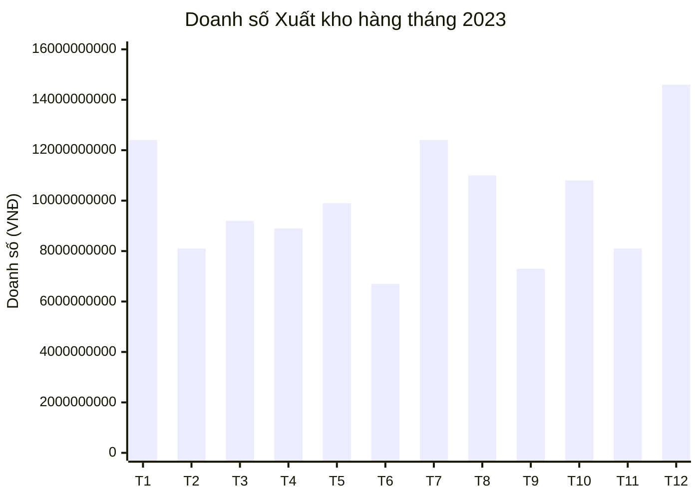
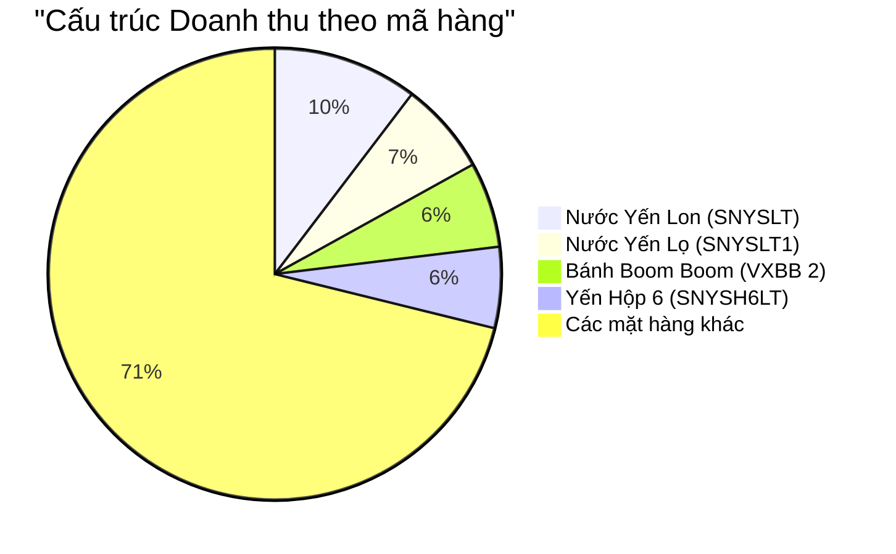
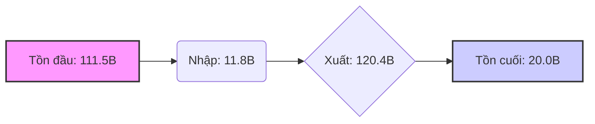

# 📊 Biểu Đồ Thống Kê 2023 - Hoàng Huy Phát

## 📅 Biến động Doanh số qua các tháng (Tỷ VNĐ)

```mermaid
xychart-beta
    title "Doanh số Xuất kho hàng tháng 2023"
    x-axis [T1, T2, T3, T4, T5, T6, T7, T8, T9, T10, T11, T12]
    y-axis "Doanh số (VNĐ)" 0 --> 16000000000
    bar [12400000000, 8100000000, 9200000000, 8900000000, 9900000000, 6700000000, 12400000000, 11000000000, 7300000000, 10800000000, 8100000000, 14600000000]
```

## 🥧 Top 5 Mặt hàng chủ lực (Tỷ trọng Doanh thu)

```mermaid
pie title "Cấu trúc Doanh thu theo mã hàng"
    "Nước Yến Lon (SNYSLT)" : 14.47
    "Nước Yến Lọ (SNYSLT1)" : 9.24
    "Bánh Boom Boom (VXBB 2)" : 8.56
    "Yến Hộp 6 (SNYSH6LT)" : 8.11
    "Các mặt hàng khác" : 99.56
```

## 💰 Biểu đồ tồn kho

```mermaid
graph LR
    A[Tồn đầu: 111.5B] --> B(Nhập: 11.8B)
    B --> C{Xuất: 120.4B}
    C --> D[Tồn cuối: 20.0B]
    style A fill:#f9f,stroke:#333,stroke-width:2px
    style D fill:#ccf,stroke:#333,stroke-width:2px
```
